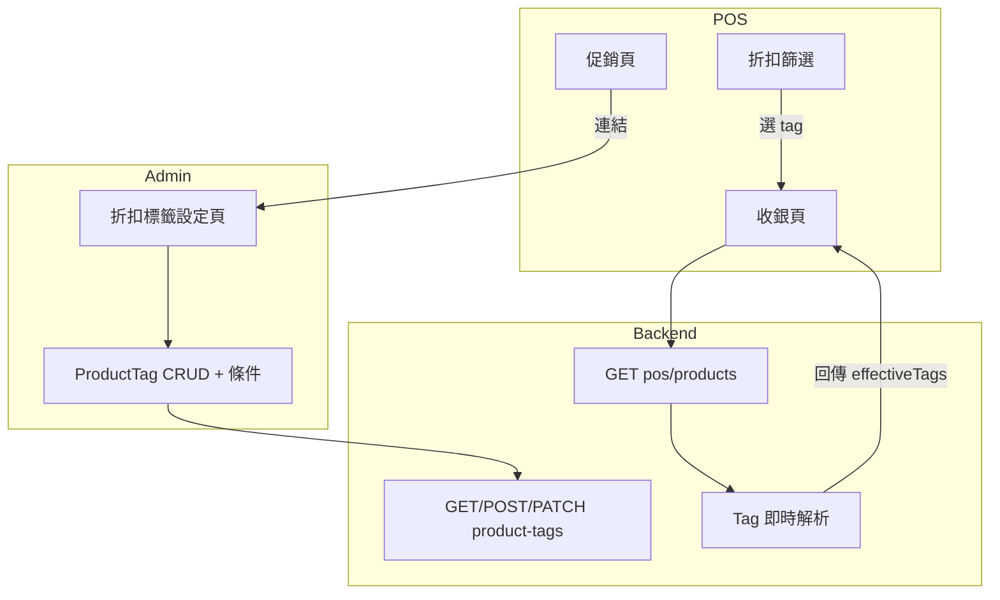

# 折扣標籤可編輯與自動貼標計畫

## 目標

- 用戶可編輯：哪些標籤作為 POS「折扣」篩選選項
- 每個標籤可設定「自動條件」：符合條件之商品即時貼上該標籤
- 後台完整編輯、收銀端檢視＋連結後台

---

## 架構概覽




---

## 一、資料模型擴充

### 1.1 ProductTag 新增欄位

在 `[backend/prisma/schema.prisma](backend/prisma/schema.prisma)` 的 `ProductTag` 新增：

```prisma
model ProductTag {
  // ... 既有欄位
  /// 是否顯示於 POS 折扣篩選列
  showInPosDiscount  Boolean  @default(true)
  /// 自動貼標條件；null = 僅手動。JSON: { type, ...params }
  autoCondition      Json?
}
```

### 1.2 autoCondition 條件類型（JSON）


| type             | 說明          | params 範例                          |
| ---------------- | ----------- | ---------------------------------- |
| `MANUAL`         | 不自動貼標，僅手動   | `{}`                               |
| `SALES_QTY`      | 銷量達門檻       | `{ lookbackDays: 30, minQty: 10 }` |
| `DISCOUNT_RATIO` | 有折扣（售價低於定價） | `{ minPercent: 5 }`                |
| `LOW_STOCK`      | 庫存低於門檻      | `{ maxQty: 5 }`                    |
| `NEW_ARRIVAL`    | 新上架         | `{ withinDays: 30 }`               |


---

## 二、後端實作

### 2.1 ProductTag CRUD 擴充

- `[ProductTagService](backend/src/modules/product-tag/application/product-tag.service.ts)`：create/update 接受 `showInPosDiscount`、`autoCondition`
- DTO：`CreateProductTagDto`、`UpdateProductTagDto` 新增對應欄位
- 回傳時包含 `showInPosDiscount`、`autoCondition`

### 2.2 新增 API

- **GET /product-tags/for-pos-discount?merchantId=**  
回傳 `showInPosDiscount = true` 的標籤，供 POS 折扣篩選選項使用。

### 2.3 即時 tag 解析服務

新建 `DiscountTagResolverService`（或放在既有 service）：

- 輸入：`Product[]`、`merchantId`、可選 `storeId`（用於庫存）
- 輸出：`Map<productId, string[]>`（每商品之 effectiveTags）
- 邏輯：
  1. 查詢該 merchant 的 ProductTag（`showInPosDiscount = true` 且 `autoCondition` 非 null）
  2. 依 `autoCondition.type` 執行對應查詢：
    - `SALES_QTY`：`PosOrderItem` 依 `productId` 彙總 `quantity`，`lookbackDays` 內達 `minQty` 則貼標
    - `DISCOUNT_RATIO`：`(listPrice - salePrice) / listPrice * 100 >= minPercent`
    - `LOW_STOCK`：彙總 `InventoryBalance.onHandQty`，若 `<= maxQty` 則貼標
    - `NEW_ARRIVAL`：`createdAt` 在 `withinDays` 內
  3. 合併 `Product.tags`（手動）與符合條件的 ProductTag.name，去重後回傳

### 2.4 整合至 POS 產品 API

- `[PosService.listProductsWithInventory](backend/src/modules/pos/application/pos.service.ts)`：取得產品後呼叫 `DiscountTagResolverService`，將 `effectiveTags` 合併進回傳的 `tags` 欄位
- 保持回傳格式不變，僅 `tags` 為合併結果

### 2.5 GET /pos/products 支援 tag 篩選（可選）

若需後端篩選，可新增 `tag` query，在合併 tags 後於後端過濾；或維持目前 client-side 篩選（方案 A 修正）。

---

## 三、前端實作

### 3.1 後台：折扣標籤設定頁

- 路徑：`/admin/discount-tags` 或併入 `/admin/categories` 的「標籤」區塊
- 功能：
  - 列表：ProductTag 名稱、是否顯示於 POS、條件類型、參數
  - 新增／編輯：名稱、`showInPosDiscount`、條件類型下拉、對應參數欄位（lookbackDays、minQty、minPercent、maxQty、withinDays）
  - 可複用 `AdminCategoriesPage` 標籤 CRUD 邏輯，擴充表單欄位

### 3.2 收銀端：PosPromosPage 擴充

- 在「進行中促銷」下方新增區塊：「折扣標籤」
  - 顯示目前作為 POS 篩選的標籤列表（唯讀）
  - 連結至後台編輯：「[後台編輯折扣標籤](/admin/discount-tags)」

### 3.3 PosPage 折扣篩選改接 API

- 移除硬編碼 `DISCOUNT_TAG_OPTIONS`
- 使用 `GET /product-tags/for-pos-discount?merchantId=` 取得選項
- 篩選邏輯：沿用現有 `filteredProducts`，並修正 `apiProducts === null` 條件（與先前優化計畫一致）
- `getPosProducts` 回傳的 `tags` 已含 effectiveTags，直接 `includes` 即可

---

## 四、資料流

1. Admin 設定 ProductTag：`showInPosDiscount`、`autoCondition`
2. POS 載入時：`getProductTagsForPosDiscount` → 得到篩選選項
3. POS 載入產品：`getPosProducts(storeId)` → 後端合併 effectiveTags 後回傳
4. 使用者選標籤 → `filteredProducts` 以 `tags.includes(selectedTag)` 過濾

---

## 五、執行順序建議

1. Schema 擴充 + migration
2. ProductTag CRUD 擴充 + GET for-pos-discount
3. DiscountTagResolverService 即時解析
4. PosService 整合 effectiveTags
5. Admin 折扣標籤設定 UI
6. PosPromosPage 新增區塊 + PosPage 改接 API
7. 修正 PosPage 篩選條件（apiProducts 連線時也套用）

---

## 六、與既有功能關係

- **ProductTag**：沿用既有 CRUD，僅新增欄位；Admin 類別管理標籤區可導向「折扣標籤」或共用編輯
- **Product.tags**：手動標籤保留；effectiveTags = 手動 + 自動
- **PromotionRule**：不變；折扣標籤為 POS 篩選用，與結帳折扣規則分離
- **Seed**：可為既有 ProductTag（熱銷、新品、清倉）加上 `autoCondition` 示範

