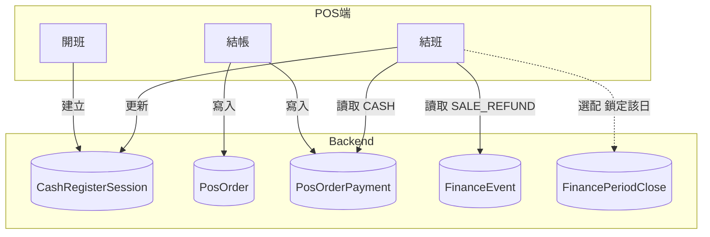

# 關帳與現金管理完整規劃

## 一、概念釐清

專案現有兩類「關帳」，需明確區分：


| 類型        | 現有實作                                           | 用途                               |
| --------- | ---------------------------------------------- | -------------------------------- |
| **期間鎖定**  | `FinancePeriodClose`、`AdminFinancePeriodsPage` | 會計層級：鎖定歷史日期區間，禁止該區間內新增/修改金流事件    |
| **日結／班結** | **尚未實作**                                       | 營運層級：開班設起始現金 → 營業 → 結班點交、對帳、產生報表 |


本規劃聚焦**日結／班結**（收銀現金對帳流程），並在關帳時可選擇性觸發期間鎖定，兩者互補。

---

## 二、核心流程設計

### 2.1 開班（Day Open）

- **時點**：每日營業開始
- **操作**：收銀員登入 → 設定**起始現金金額**（找零用）→ 系統建立「當班紀錄」
- **業務規則**：
  - 同一門市同一營業日僅允許一筆「開班中」session（避免重複開班）
  - 營業日可依店家需求定義（如 06:00～隔日 05:59，或 00:00～23:59）

### 2.2 班中管理

- 查詢當班：銷售金額、交易筆數、退貨筆數
- 監控**現金應有額**：`起始現金 + 現金銷售 - 現金退款`（即時計算）

### 2.3 結班／日結（Day Close）

- 系統統計該班次：各支付方式應收、現金應有額
- 收銀員輸入**實際點交金額**
- 計算**差異** = 實際 - 應有
- 產生**結帳報表**（可匯出／列印）
- 結束後**鎖定該班別**交易（修改需特別權限，可與 `FinancePeriodClose` 整合）

---

## 三、資料模型

### 3.1 新增：CashRegisterSession（收銀班次）

```
model CashRegisterSession {
  id                String    @id @default(uuid())
  store             Store     @relation(...)
  storeId           String
  merchantId        String    // 冗餘，方便查詢
  openedAt          DateTime  @default(now())
  closedAt          DateTime?
  openingCashAmount Decimal   @db.Decimal(12, 2)  // 起始現金
  expectedCashAmount Decimal? @db.Decimal(12, 2)  // 關帳時計算
  actualCashAmount  Decimal?  @db.Decimal(12, 2)  // 實際點交
  differenceAmount  Decimal?  @db.Decimal(12, 2)  // 差異
  openedBy          String?
  closedBy          String?
  status            String    @default("OPEN")    // OPEN | CLOSED
  note              String?
  createdAt         DateTime
  updatedAt         DateTime

  @@index([storeId, status, openedAt])
  @@index([merchantId, openedAt])
}
```

- **Store** 需加上 `CashRegisterSession[]` 關聯
- 營業日範圍：建議以 `openedAt` 當日 00:00～23:59 為預設；若跨日營業，可擴充 `businessDate` 欄位

### 3.2 現金應有額計算

- **現金銷售**：`PosOrderPayment` 中 `method = 'CASH'` 且訂單 `createdAt` 落在 session 區間
- **現金退款**：
  - **Phase 1**：假設所有 `SALE_REFUND` 皆為現金（保守估計，符合多數現金為主的店面）
  - **Phase 2**：擴充退款 API 支援 `refundMethod`，或由原訂單付款方式推算

---

## 四、API 規格

### 4.1 開班


| Method | Path               | 說明                                                                                   |
| ------ | ------------------ | ------------------------------------------------------------------------------------ |
| POST   | /pos/sessions/open | Body: `{ storeId, openingCashAmount, openedBy? }`；檢查該 store 今日是否已有 OPEN session，無則建立 |


### 4.2 班中查詢


| Method | Path                  | 說明                                                                                                                                  |
| ------ | --------------------- | ----------------------------------------------------------------------------------------------------------------------------------- |
| GET    | /pos/sessions/current | Query: `storeId`；回傳該門市目前 OPEN 的 session，含 `openingCashAmount`、`cashSales`、`cashRefunds`、`expectedCash`、`ordersCount`、`refundsCount` |


### 4.3 結班


| Method | Path                    | 說明                                                                                              |
| ------ | ----------------------- | ----------------------------------------------------------------------------------------------- |
| POST   | /pos/sessions/:id/close | Body: `{ actualCashAmount, closedBy?, note? }`；計算 expected、difference，更新 status=CLOSED、closedAt |


### 4.4 歷史查詢


| Method | Path              | 說明                                                                                    |
| ------ | ----------------- | ------------------------------------------------------------------------------------- |
| GET    | /pos/sessions     | Query: `storeId?`, `merchantId?`, `status?`, `from`, `to`, `page`, `pageSize`；列表已關帳班次 |
| GET    | /pos/sessions/:id | 單筆詳情，含關帳報表摘要                                                                          |


### 4.5 關帳報表（結班時回傳／可重查）

- 回傳結構：`period`、`openingCash`、`cashSales`、`cashRefunds`、`expectedCash`、`actualCash`、`difference`、`byPaymentMethod`、`ordersCount`、`refundsCount`

---

## 五、前端規劃

### 5.1 POS 端（收銀員使用）

- **開班入口**：POS 首頁或登入後第一個步驟，輸入起始現金後開班
- **班中看板**：顯示當班銷售、現金應有額、交易筆數（可嵌入既有 POS 報表頁或獨立小工具）
- **結班入口**：輸入實際點交金額 → 顯示差異 → 確認後關帳，可列印/匯出日結報表

### 5.2 Admin 端

- **班次列表頁**：`/admin/pos/sessions`，依門市/日期篩選，可查看歷史關帳紀錄與差異
- **與關帳區間整合**：日結完成後，可選「同時關帳該日」（呼叫既有 `POST /finance/periods/close`），一鍵完成營運＋會計鎖定

---

## 六、額外實用功能


| 功能         | 說明                                                          |
| ---------- | ----------------------------------------------------------- |
| **差異警示**   | 關帳時若                                                        |
| **日結報表匯出** | PDF 或 CSV，含各支付方式、現金對帳明細，供留存／對帳                              |
| **跨日營業**   | 支援 `businessDate` 與 `openedAt` 分離，應付深夜跨日場景                  |
| **多收銀機**   | 同一門市多台收銀機時，可擴充 `registerId` 或 `CashRegister` 表，每台獨立 session |
| **自動關帳提醒** | 若逾營業結束時間仍未關帳，後台顯示待關帳提醒                                      |


---

## 七、與既有模組關係




---

## 八、實作階段建議


| Phase       | 內容                                                                    |
| ----------- | --------------------------------------------------------------------- |
| **Phase 1** | CashRegisterSession 表、開班/結班 API、班中 current API、POS 開班/結班流程、Admin 班次列表 |
| **Phase 2** | 差異警示、日結報表匯出、退款方式區分（擴充 SALE_REFUND 或退款 API）                            |
| **Phase 3** | 多收銀機、跨日營業、自動關帳提醒、與 FinancePeriodClose 一鍵整合                            |


---

## 九、關鍵檔案參考

- 規格依據：[erp-spec.md](erp-spec.md) §5.3 班表與收銀結帳
- 現有關帳（期間鎖定）：[AdminFinancePeriodsPage.tsx](frontend/src/pages/admin/AdminFinancePeriodsPage.tsx)、[finance.service.ts](backend/src/modules/finance/application/finance.service.ts)
- 付款方式彙總：[pos-reports.service.ts](backend/src/modules/pos/application/pos-reports.service.ts)（byPaymentMethod）
- Schema：[schema.prisma](backend/prisma/schema.prisma)（Store、PosOrder、PosOrderPayment、FinanceEvent）

