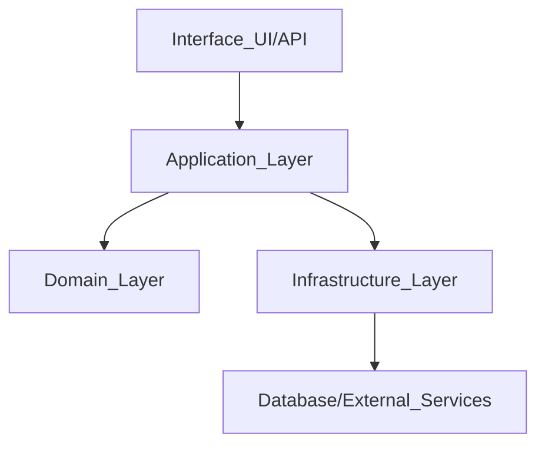

## ERP 專案開發守則

本文件是本地部署 ERP 專案的「開發憲法」。  
所有開發人員（含未來不同 AI coding 工具）都必須遵守此文件，若有重大偏離，必須先更新本文件再實作。

目標：

- **保有大局觀**：所有決策以「整體架構與長期維護成本」為優先，而非局部方便。
- **保持簡潔乾淨**：減少不必要抽象、過度魔術與隱性依賴，讓任何工具 / 人員都能快速上手。
- **泛用性與可組合性**：函式與模組應優先設計為可重用與可組合，而非為某一畫面硬寫。
- **架構防火牆**：明確劃分模組與層級邊界，避免「修東牆倒西牆」式的連鎖破壞。

---

## 1. 專案願景與整體原則

- **以業務領域為中心，而非框架為中心**
  - 優先思考「商家、供應商、商品、庫存、消費者、POS、採購、CRM、財務」等領域概念。
  - 技術框架（Web、DB、ORM）是實作細節，不得反客為主。

- **局部優化不得犧牲全域一致性**
  - 嚴禁為了某一頁面 / 某一 API 的短期方便，直接跳過既有層級或邊界。
  - 新功能實作前，先確認是否能透過既有 Domain / Application 層擴充。

- **讀性優先於寫性，穩定優先於炫技**
  - 杜絕過度巫術（隱式反射、黑盒魔術、過度動態）。
  - 任何有技巧性的寫法，都要能讓兩週沒碰專案的人 5 分鐘內看懂。

- **文件與程式碼同步演進**
  - 架構與規則改動，必須更新本文件與相關模組說明，否則一律視為「規格外實作」。

---

## 2. 架構與分層原則

### 2.1 高階架構分層

全系統採用 4 層分層觀念（語言與框架無關）：

- **Domain Layer（領域層）**
  - 放置核心業務規則與實體（Entities / Aggregates / Value Objects）。
  - 僅包含純邏輯，不直接呼叫資料庫、外部 API 或框架元件。
  - 使用公司與領域專用名詞命名，具高度穩定性。

- **Application Layer（應用層 / 用例層）**
  - 負責具體用例流程（Use Cases / Services），協調多個 Domain 物件與外部資源。
  - 僅依賴 Domain 介面，不依賴具體 DB / 第三方實作。
  - 例如：「建立採購單」、「POS 結帳」、「執行盤點調整」等。

- **Interface Layer（介面層：API / UI）**
  - 對外暴露 HTTP API、RPC、前端 UI 等。
  - 負責 Request 驗證、輸入輸出 DTO Mapping，不放業務規則。
  - 僅呼叫 Application 層，不得直接操作資料庫或其他 Infrastructure。

- **Infrastructure Layer（基礎設施層）**
  - DB、快取、外部服務、Message Queue 等實作。
  - 實作 Domain / Application 定義的介面（如 Repository、Gateway）。
  - 不得反向依賴上層（Domain / Application）。

呼叫方向必須自上而下，禁止反向。

### 2.2 分層依賴規則

- Domain **不**依賴任何框架、ORM、HTTP Library。
- Application 僅依賴：
  - Domain 模型與介面
  - 抽象的 Repository / Gateway 介面
- Interface 層：
  - 可以依賴框架（例如 Web Framework、UI Framework）。
  - 僅呼叫 Application 提供的 Use Case 服務。
- Infrastructure 層：
  - 實作 Repository / Gateway 等介面，注入給 Application / Domain 使用。

違規範例（不得出現）：

- UI Controller 直接呼叫 ORM 查 DB。
- Domain Entity 內出現 SQL Query、HTTP Request。
- 任意模組繞過 Application 層，直接跨模組呼叫 Infrastructure。

---

## 3. 模組化與邊界（防火牆）

### 3.1 模組切分原則

模組以「業務領域」切分，而不是以「技術」切分：

- 範例模組：
  - `Merchant`：商家 / 組織
  - `Supplier`：供應商
  - `Product`：商品
  - `Inventory`：庫存與庫存異動
  - `Customer`：消費者 / 會員
  - `POS`：前端消費交易（銷售、退貨、日結）
  - `Purchase`：採購與驗收
  - `CRM`：分級、分群、行銷活動、點數、券
  - `Finance`：應收 / 應付、對帳

每個模組內，依前述 4 層結構再細分：

- `Merchant.Domain`, `Merchant.Application`, `Merchant.Interface`, `Merchant.Infrastructure` 等（具體目錄結構視技術堆疊決定）。

### 3.2 模組依賴「防火牆」規則

- **同層模組之間不得直接互相依賴實作**：
  - 例如 `CRM.Application` 不得直接 new `POS.Application` 具體類別。
  - 若有共用邏輯，須抽至共用 Domain Service / Shared Kernel。

- **跨模組邏輯流轉，只能透過明確介面 / 事件**：
  - 例如：POS 成交後通知 CRM 累積點數：
    - POS.Application 發出「銷售完成事件」。
    - CRM.Application 訂閱或透過 Application 介面處理點數邏輯。

- **禁止「隨手跨模組查 DB」**：
  - 任一模組若需要他模組資料，只能透過對方公開的 Application / Domain 介面或查詢 API。

### 3.3 變更隔離策略

新增需求或修改時，必須先自問：

1. 這次變更「屬於哪個模組的責任」？
2. 是否會影響現有的公開介面（API / Service 合約）？
3. 若要修改合約，是否會影響其他模組？是否應新增版本或保持向下相容？

原則：

- 模組公開介面（API / Service Contract）一經對外使用，即視為「穩定合約」，修改需：
  - 更新文件
  - 通知受影響模組 / 使用端
  - 優先新增欄位 / 新 API，而非破壞性修改

---

## 4. 函式與 API 設計準則（泛用性）

### 4.1 函式設計

- **單一責任**：每個函式只做一件清楚的事。若同時處理多種概念（例如查詢 + 寫入 + 發通知），應拆成多個函式。
- **明確輸入輸出**：
  - 避免依賴全域變數或隱藏狀態。
  - 優先使用結構化參數（例如 Options 物件），避免過多位置參數。
- **泛用性優先**：
  - 若相似需求出現第二次，優先抽象成可傳入參數或策略函式，而非複製貼上程式碼。
  - 不為某一特定頁面硬寫函式名稱（例如 `getHomePageData`），而是以業務語言命名（例如 `getDailySalesSummary`）。
- **標準化回傳格式**：
  - Domain / Application 層可採類似：
    - 成功：回傳資料結構。
    - 失敗：回傳業務錯誤型別或結果物件（例如 `Result<T>` 型態內含 `isSuccess`, `errorCode`）。

### 4.2 API 設計（HTTP / RPC 通用規則）

- **Command vs Query 分離**
  - **Query**：不改變系統狀態，只讀取資料。應設計為可重複呼叫、無副作用。
  - **Command**：會改變狀態的操作（新增、修改、刪除、流程執行）。

- **以資源為中心命名**
  - 資源例：`/merchants`, `/suppliers`, `/products`, `/inventory-movements`, `/sales-orders`。
  - 避免以頁面名稱或 UI 用語命名（例如 `/posPageInit`）。

- **錯誤結構統一**
  - 至少包含：
    - `code`：錯誤代碼（可對應業務 / 系統錯誤）
    - `message`：供前端 / 人員閱讀的簡短描述
    - `details`：選填，供除錯用的細節（避免敏感資訊）
    - `traceId`：追蹤用 ID，方便對照後端 Log

- **版本管理**
  - 外部公開 API 建議加上版本（如 `/api/v1/...`），避免日後調整破壞既有客戶端。

---

## 5. 資料模型與資料庫存取原則

### 5.1 資料模型（Domain Model）

- **以領域語言命名**
  - 例如：`PurchaseOrder`, `PurchaseOrderLine`, `InventoryAdjustment`, `SalesReceipt`, `CustomerTier`。
  - 禁止出現過度技術名詞作為 Domain 主名（例如 `Tbl1`, `DataModelX`）。

- **避免 Domain 直接依賴 ORM / DB 細節**
  - Domain 物件不得出現 ORM 註解、SQL 字串或 Connection 物件。
  - 若需對應資料表，由 Infrastructure 負責 Mapping。

### 5.2 資料存取（Repository / DAO 原則）

- **集中化資料存取**
  - 所有 DB 讀寫需通過 Repository / DAO 介面，不許任意在業務邏輯中散落查詢。
  - 查詢複雜度（Join / Index / 分頁）在 Infrastructure 層解決，對 Domain 暴露簡潔方法：
    - 例如 `findAvailableInventoryForProduct(productId)` 而非讓 Domain 自行寫查詢。

- **查詢 vs 寫入**
  - Extract Query / Command Repository，或至少在命名中明確標示。

---

## 6. 例外處理與錯誤回報策略

### 6.1 錯誤分類

- **業務錯誤（Business Error）**
  - 例如：庫存不足、會員資格不符、折扣條件不成立。
  - 應在 Domain / Application 層以明確錯誤碼或型別表示。

- **系統錯誤（System Error）**
  - 例如：資料庫連線失敗、外部服務逾時、未預期例外。
  - 應集中紀錄 Log，並對外回傳「泛用、安全」的錯誤訊息。

### 6.2 錯誤處理原則

- **就近處理，可預期的業務錯誤**
  - Use Case 中預期到的情境（如「庫存可能不足」）應回傳業務錯誤結果，由上層 UI / API 呈現對應訊息。

- **集中處理，不可預期的系統錯誤**
  - 在 API 邊界設定全域 Exception Handler：
    - 記錄完整 Log（含 traceId、使用者 id、模組、輸入摘要）。
    - 對前端回傳統一格式的「系統錯誤」訊息，不曝露內部堆疊。

- **錯誤回應結構範型（邏輯層級）**
  - 成功：
    - `{ success: true, data: ... }`
  - 失敗：
    - `{ success: false, code: "BUSINESS_RULE_X", message: "人類可讀訊息", traceId: "..." }`

---

## 7. 測試策略（單元 / 模組 / 端對端）

### 7.1 最低測試標準

- **Domain 層**
  - 所有核心領域服務與關鍵實體行為必須有單元測試。
  - 例如：庫存異動計算、價格與折扣邏輯、點數累積規則。

- **Application 層**
  - 關鍵用例需有整合測試（mock 外部資源），驗證流程正確。
  - 例如：POS 結帳流程、採購驗收流程、盤點流程。

- **Interface / API 層**
  - 至少對關鍵 API（銷售、退貨、進貨）提供端對端測試樣本流程。

### 7.2 測試設計原則

- 測試名稱描述**行為與期望結果**，非只寫 Ticket 編號。
- 測試資料盡量貼近實際業務情境：
  - 例如：商品含有效期、促銷期間、會員等級等。
- 對重要 Bug 修復，新增 Regression Test，避免再度發生。

### 7.3 自動化品質檢查

- 所有提交（或 PR）在合併前必須至少通過：
  - Lint（靜態檢查）
  - Formatter（自動格式化）
  - 單元測試（或至少核心模組的測試）

---

## 8. 程式碼風格與註解原則

### 8.1 風格

- 採用各語言社群的標準 Style Guide，並以工具自動格式化（避免人工討論縮排與括號風格）。
- 命名一致性：
  - 類別 / 型別：使用 PascalCase。
  - 函式 / 方法：使用小駝峰命名（camelCase），以動詞開頭（例如：`calculate`, `get`, `create`）。
  - 變數：語意清楚、避免縮寫（除非明顯如 `id`, `qty`）。

### 8.2 註解

- 只針對「意圖不易從程式碼看出」的地方撰寫註解：
  - 複雜業務規則
  - 歷史包袱（暫時無法調整的相容性處理，需說明原因）
- 嚴禁「翻譯式註解」：
  - 例如：`// add 1 to i`、`// 呼叫 API 取得資料`。
- 關鍵 Domain Service 或 Aggregate Root 上方可有短段落描述該物件在業務中的角色。

---

## 9. 變更管理、Code Review 與 AI 工具使用

### 9.1 變更流程

- 新需求或變更，建議流程：
  1. 在需求 / 規格文件（如 `erp-spec.md`）更新對應內容。
  2. 如有跨模組影響，先在簡圖或文字中描述受影響的模組 / API / DB。
  3. 確認不會打破既有公開合約，或明確標示為新版本。
  4. 才開始實作與提 PR。

- 對於「暫時性方案 / Workaround」：
  - 必須加上 `TODO` 或註解，說明為何暫時這樣做 & 未來預計改成什麼。
  - 應在 Issue Tracker 中建立對應任務。

### 9.2 Code Review 原則

- Review 主要關注點：
  - 有沒有破壞架構分層或模組邊界？
  - 是否能用更泛用的抽象方式，避免過度針對單一需求硬寫？
  - 是否新增了隱藏耦合（例如跨模組直接查 DB）？
  - 是否有足夠測試覆蓋關鍵邏輯？

- Review 風格：
  - 盡量提出具體建議（「可以改成 X，原因是 Y」），避免只說「這樣不好」。
  - 對風格問題優先交給 Lint / Formatter 處理，不在 Review 時糾結排版。

### 9.3 AI coding 工具使用守則

- **允許使用多種 AI 工具產生程式碼與設計草案**，但必須滿足：
  - 產出程式碼仍須由人類 / 主責開發者檢查與理解。
  - 不得直接將未審查的輸出貼入生產分支。
  - 任何 AI 產生的設計若涉及架構變更，必須先對照本文件確認是否相容。

- 若 AI 產生大量重複邏輯：
  - 優先考慮抽出為泛用模組或 Utility，減少後續維護成本。

### 9.4 每日開發進度產出（貼至 Notion）

- 在 Cursor 中下達 **「產生今日開發進度」** 時，AI 會依專案規則產出三欄格式：**今日完成**、**卡點**、**To Do**，供複製貼到 Notion。
- 格式與內容來源定義見 [docs/daily-progress-format.md](docs/daily-progress-format.md)；Cursor 規則見 `.cursor/rules/daily-progress.mdc`。

---

## 10. 整體品質守門機制

### 10.1 本機開發規則

- 開發者在提交前必須：
  - 執行 Lint / Format 工具。
  - 執行至少核心模組單元測試。
  - 確認無明顯 Type / 編譯錯誤。

- 如有時間壓力，允許先提交不完美的實作，但必須：
  - 明確標註 `TODO` 與技術債說明。
  - 不得破壞既有 API / 資料結構向後相容性，除非已提前溝通。

### 10.2 CI / 自動化（可逐步導入）

- 未來導入 CI 時，最低流程：
  1. 安裝依賴。
  2. 執行 Lint。
  3. 執行單元測試。
  4. 執行建置流程（Build）。

- CI 未通過時，不得合併至主線分支（main / master / develop）。

---

## 11. 與此 ERP 專案相關的特別約定

- **庫存與金流採「事件 + 匯總」模型**
  - 所有庫存與金流異動都必須先寫入不可變的事件表（如 `InventoryEvent`、`FinanceEvent`），只能新增事件，不得修改或刪除既有事件。
  - 即時庫存、應收應付等數字僅為事件的匯總結果（如 `InventoryBalance`、`ArApSummary`），若發現不一致，應透過「重算匯總」而非手工改數字。
  - 相關概念與作法詳見 `docs/inventory-finance-immutability.md`。

- **庫存異動必須集中控管**
  - 所有會影響庫存的操作（銷售、退貨、進貨、退供、調撥、盤點）都必須經過統一的 `Inventory` 模組服務或 Application 用例。
  - 禁止在其他模組自行修改庫存資料表或直接對匯總表執行 UPDATE。

- **財務數字的唯一來源**
  - 應收 / 應付與營收相關數字須來自統一的交易與進貨紀錄匯總（由金流事件計算而來），禁止手工修改財務結果表。
  - 關帳後的期間，如需調整，必須透過明確的「調整用例」產生新事件與 Audit Log，不得直接改舊資料。

- **行銷與 CRM 的獨立性**
  - 行銷活動、點數、優惠券不應硬寫在 POS 流程內部。
  - POS 僅負責「告知交易事實」，由 CRM 模組根據活動規則計算回饋。

---

## 12. 文件維護原則

- 本文件如有重大變更，需：
  - 經過至少一位負責架構的成員確認。
  - 在變更紀錄中簡述「為何需要改這條守則」。
- 新人加入專案時，需先閱讀本文件，再開始撰寫程式碼。

