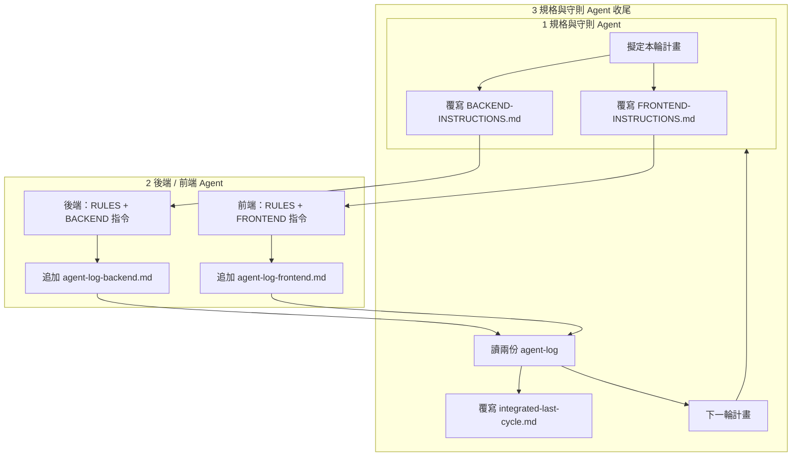

# Agent 協作流程（唯一流程說明）

> **一次拖一個資料夾**：規格／收尾時請把 **`docs/agent-collab/`** 整夾拖進對話（內含本檔 + **agent-log-backend.md** + **agent-log-frontend.md**），不必再分開拖三個檔。

本檔定義三種角色與**固定檔案**。**Owner 不必再打指令**：把下表「要丟的檔」拖進對話即可；Agent 依檔內連結讀守則並執行。

## 只丟檔、不打字（建議）

| 你開的對話 | 拖進對話的檔（至少） | Agent 會做的事 |
|------------|----------------------|----------------|
| **規格與守則** | **整夾 `docs/agent-collab/`**（或本檔 + 兩份 agent-log） | 步驟 1 或 3：覆寫 BACKEND／FRONTEND 指令 + 可選覆寫 integrated-last-cycle |
| **後端** | [BACKEND-INSTRUCTIONS.md](../tasks/BACKEND-INSTRUCTIONS.md) | 讀 RULES + COLLABORATION 步驟 2 → 實作 → 追加 agent-log-backend |
| **前端** | [FRONTEND-INSTRUCTIONS.md](../tasks/FRONTEND-INSTRUCTIONS.md) | 讀 RULES + COLLABORATION 步驟 2 → 實作 → 追加 agent-log-frontend |

若對話只吃單檔：後端／前端指令檔**開頭已寫**必讀 `AGENT-RULES.md` 與本檔，Agent 應主動開 Repo 內該路徑。

### 三個對話分開（建議）

| 對話 | 第一則訊息 | 說明 |
|------|------------|------|
| **規格** | 拖 **`docs/agent-collab/`** 整夾（或 `@docs/agent-collab/AGENT-COLLABORATION.md`）+ 可選「步驟 1」或「步驟 3」 | 勿與寫碼混在同一對話 |
| **後端** | 只 `@docs/tasks/BACKEND-INSTRUCTIONS.md` | 新對話、乾淨上下文 |
| **前端** | 只 `@docs/tasks/FRONTEND-INSTRUCTIONS.md` | 同上 |

### Cursor @ 檔案

- **等同拖檔**：輸入 `@` 後選檔名或資料夾。
- 專案已設 **`.cursor/rules`**：當 **BACKEND／FRONTEND INSTRUCTIONS** 在上下文內時，會提醒先讀本檔步驟 2 與 **AGENT-RULES**。

---

本檔以下定義三種角色與**固定檔案**；所有 Agent 先讀本檔再動工。

| 角色 | 職責 |
|------|------|
| **規格與守則 Agent** | 擬定開發計畫 → 覆寫兩份指令檔 → 讀兩份開發紀錄 → 寫整合紀錄 → 覆寫下一輪指令（循環） |
| **後端 Agent** | 只讀 [AGENT-RULES.md](../AGENT-RULES.md) + [BACKEND-INSTRUCTIONS.md](../tasks/BACKEND-INSTRUCTIONS.md) → plan／執行 → 追加 [agent-log-backend.md](agent-log-backend.md) |
| **前端 Agent** | 只讀 [AGENT-RULES.md](../AGENT-RULES.md) + [FRONTEND-INSTRUCTIONS.md](../tasks/FRONTEND-INSTRUCTIONS.md) → plan／執行 → 追加 [agent-log-frontend.md](agent-log-frontend.md) |

---

## 流程圖

---

## 步驟 1（規格與守則 Agent）

1. 依產品目標擬定**本輪**後端／前端任務（可參考 [bulk-import-export-plan.md](../bulk-import-export-plan.md) 等規格檔，不必寫進指令裡全文）。
2. **覆寫**（可整檔重寫，**不需保留上一輪內容**）：
   - [tasks/BACKEND-INSTRUCTIONS.md](../tasks/BACKEND-INSTRUCTIONS.md)
   - [tasks/FRONTEND-INSTRUCTIONS.md](../tasks/FRONTEND-INSTRUCTIONS.md)
3. 每份指令檔：**只改「§1 本輪必做」編號清單**（其餘 §0 常駐／§2～§4 為固定範本，**勿刪**檔首「常駐指令（測試資料）」）。§1 必須是可執行行為，不可把「修改本 md」當任務。

---

## 步驟 2（後端／前端 Agent）

1. 讀 [AGENT-RULES.md](../AGENT-RULES.md)（守則與必讀 API 路徑）。
2. 讀本角色指令檔（後端：`BACKEND-INSTRUCTIONS.md`；前端：`FRONTEND-INSTRUCTIONS.md`）。
3. 自行 plan 與實作；改 API 先改 `docs/api-design-*.md`（見 RULES）。
4. **完成後必做**（寫入同一輪，勿漏）：
   - **後端**：在 [agent-log-backend.md](agent-log-backend.md) **最下方追加一筆**（格式見該檔開頭）。
   - **前端**：在 [agent-log-frontend.md](agent-log-frontend.md) **最下方追加一筆**。

（選配）若仍沿用「當日進度檔」給人看，可另寫 `backend-progress-YYYY-MM-DD.md` 等；**規格 Agent 收斂時以兩份 agent-log 為準**。

---

## 步驟 3（規格與守則 Agent）

1. 讀 [agent-log-backend.md](agent-log-backend.md)、[agent-log-frontend.md](agent-log-frontend.md) **最新一輪**條目。
2. **覆寫** [progress/integrated-last-cycle.md](../progress/integrated-last-cycle.md)：本輪後端完成摘要、本輪前端完成摘要、整合風險／待對齊、**下一輪建議焦點**。
3. 回到**步驟 1**：依「下一輪焦點」再次覆寫 `BACKEND-INSTRUCTIONS.md` 與 `FRONTEND-INSTRUCTIONS.md`。

---

## 固定檔案一覽

| 檔案 | 誰寫入 | 是否保留歷史 |
|------|--------|----------------|
| [tasks/BACKEND-INSTRUCTIONS.md](../tasks/BACKEND-INSTRUCTIONS.md) | 規格 Agent | **否**（每輪覆寫） |
| [tasks/FRONTEND-INSTRUCTIONS.md](../tasks/FRONTEND-INSTRUCTIONS.md) | 規格 Agent | **否** |
| [agent-log-backend.md](agent-log-backend.md) | 後端 Agent | **是**（僅追加） |
| [agent-log-frontend.md](agent-log-frontend.md) | 前端 Agent | **是**（僅追加） |
| [progress/integrated-last-cycle.md](../progress/integrated-last-cycle.md) | 規格 Agent | **否**（每輪覆寫；上一輪摘要只存在於 git 歷史） |

---

## 目錄入口

- 守則：**[AGENT-RULES.md](../AGENT-RULES.md)**
- 任務指令：**[tasks/README.md](../tasks/README.md)**
- 技術協作細節：**[collaboration-rules-backend-frontend.md](../collaboration-rules-backend-frontend.md)**
