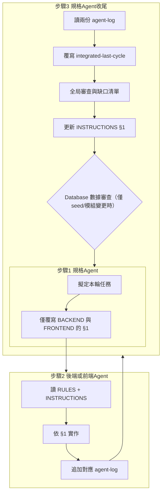

# Agent 協作流程（唯一流程說明）

本檔定義三種角色、固定檔案與三步驟。**人類**：依下表提供檔案即可；**Agent**：依檔內連結讀取守則並執行對應步驟。

### 對話窗與角色（一定要分清楚）

- **「規格」對話窗**：你把整個 `docs/agent-collab/`（或本檔＋兩份 log）@ 進來，用來**制定／更新開發計畫**。只在這個對話窗中，Agent 會修改兩份 INSTRUCTIONS 的 §1 和 `integrated-last-cycle.md`。  
- **「Backend」對話窗**：只 @ `docs/tasks/instructions/`，開啟**最新編號**的後端 INSTRUCTIONS，Agent 視為「後端 Agent」，**只讀 §1、寫程式、跑測試、追加 `agent-log-backend.md`**，不改任何 INSTRUCTIONS 內容。  
- **「Frontend」對話窗**：只 @ `docs/tasks/instructions/`，開啟**最新編號**的前端 INSTRUCTIONS，Agent 視為「前端 Agent」，**只讀 §1、寫程式、跑測試、追加 `agent-log-frontend.md`**，同樣不改 INSTRUCTIONS。  

> 心智模型：  
> - **INSTRUCTIONS §1 = 下一輪尚未完成的任務清單**（只由「規格」對話窗更新）。  
> - **實際完成／未完成狀態與測試結果 = 兩份 agent-log**（只由 Backend／Frontend 對話窗追加）。  
> - **整體進度總結與下一輪焦點 = `progress/integrated-last-cycle.md`**（只在「規格」對話窗更新）。

---

## 一、如何觸發（人類要丟什麼檔）

| 觸發情境 | 提供的檔案 | Agent 應執行 |
|----------|------------|--------------|
| **規格／收尾** | 整個資料夾 **`docs/agent-collab/`** 或 本檔 + [agent-log-backend.md](agent-log-backend.md) + [agent-log-frontend.md](agent-log-frontend.md) | **規格與守則 Agent**：步驟 3（讀兩份 log → 覆寫 integrated-last-cycle）→ 步驟 1（覆寫兩份 INSTRUCTIONS 的 §1） |
| **只發本輪任務** | 同上 | **規格與守則 Agent**：步驟 1（覆寫兩份 INSTRUCTIONS 的 §1） |
| **後端實作** | [tasks/instructions/](../tasks/instructions/) | **後端 Agent**：步驟 2（讀 RULES + 本檔步驟 2 → 依最新編號 INSTRUCTIONS 的 §1 實作 → 追加 agent-log-backend） |
| **前端實作** | [tasks/instructions/](../tasks/instructions/) | **前端 Agent**：步驟 2（讀 RULES + 本檔步驟 2 → 依最新編號 INSTRUCTIONS 的 §1 實作 → 追加 agent-log-frontend） |

- 若僅能提供單一檔案：後端／前端 INSTRUCTIONS 檔首已註明必讀 [AGENT-RULES.md](../AGENT-RULES.md) 與本檔，Agent 應主動開啟該路徑。
- Cursor 中可用 `@` 選檔案或資料夾，等同拖檔。

---

## 二、角色與固定檔案

| 角色 | 職責 |
|------|------|
| **規格與守則 Agent** | 只在「規格」對話窗中運作：撰寫／更新兩份 INSTRUCTIONS 的 **§1**（僅保留「尚未完成的任務」）、讀兩份 agent-log、覆寫 integrated-last-cycle，再依下一輪焦點重寫 §1。 |
| **後端 Agent** | 在「Backend」對話窗中運作：讀 [AGENT-RULES.md](../AGENT-RULES.md) 與 [tasks/instructions/](../tasks/instructions/) 中**最新編號**的後端 INSTRUCTIONS §1，依任務實作與測試；**完成後在 [agent-log-backend.md](agent-log-backend.md) 最上方追加一筆，說明每一項 §1 任務的完成／未完成狀態與測試結果**。不修改 INSTRUCTIONS 內容。 |
| **前端 Agent** | 在「Frontend」對話窗中運作：讀 [AGENT-RULES.md](../AGENT-RULES.md) 與 [tasks/instructions/](../tasks/instructions/) 中**最新編號**的前端 INSTRUCTIONS §1，依任務實作與測試；**完成後在 [agent-log-frontend.md](agent-log-frontend.md) 最上方追加一筆，說明每一項 §1 任務的完成／未完成狀態與測試結果**。不修改 INSTRUCTIONS 內容。 |

| 檔案 | 寫入者 | 寫入方式 |
|------|--------|----------|
| [tasks/instructions/](../tasks/instructions/) | 規格 Agent | **只更新最新檔案之 §1；更新完成後產生 `NNN+1` 新編號檔案，並刪除舊檔**（確保資料夾永遠只保留最新一組；§0、§2～§4 與檔首常駐指令勿刪；§1 只放「下一輪尚未完成的任務」） |
| [agent-log-backend.md](agent-log-backend.md) | 後端 Agent | **僅追加**（不刪改既有條目） |
| [agent-log-frontend.md](agent-log-frontend.md) | 前端 Agent | **僅追加**（不刪改既有條目） |
| [progress/integrated-last-cycle.md](../progress/integrated-last-cycle.md) | 規格 Agent | **整檔覆寫**（每輪收尾時） |

---

## 三、步驟定義（給 Agent 執行用）

### 步驟 1（規格與守則 Agent）

1. 在「規格」對話窗中，依產品目標或 [progress/integrated-last-cycle.md](../progress/integrated-last-cycle.md) 的「全局審查缺口清單」擬定本輪任務。  
2. **只修改** [tasks/instructions/](../tasks/instructions/) 中的兩份 INSTRUCTIONS 的 **§1**，並在更新完成後：  
   - 產生 `NNN+1` 新編號檔案  
   - **刪除舊檔**（確保資料夾永遠只保留最新一組）  
   - §1 只列出「**下一輪尚未完成、需要 Backend／Frontend 去做的任務**」，完成的任務不要留在 §1，改由 agent-log + integrated-last-cycle 記錄歷史。  
   - **禁止**：整份重寫、刪除 §0 常駐指令、刪除 §2～§4。  
   - §1 內容必須為**可執行的開發行為**（例如「實作 GET /foo」「補 integration-spec」「跑 build + E2E」），不可將「修改本 md」當作任務。
3. 如有前後端依賴，在兩份 INSTRUCTIONS 的 §1 或 §0 中明確寫出：  
   - 後端：標註「前端須等此項完成後再實作對應 UI／API」。  
   - 前端：標註「須後端 OOO 上線」及可開始條件，建議附檢查方式（例如 curl 或 e2e 名稱）。

### 步驟 2（後端 Agent 或 前端 Agent）

> 這一步在「Backend」或「Frontend」對話窗中執行，**不會改動 INSTRUCTIONS 檔案本身**。

1. 讀 [AGENT-RULES.md](../AGENT-RULES.md)（守則與 api-design 路徑）。  
2. 讀本角色對應的 INSTRUCTIONS 檔（後端或前端），**只使用 §1 做為本輪任務清單，不改動其內容**。  
3. 依 §1 擬定實作計畫並執行；**改 API 前先改** `docs/api-design-*.md`（見 RULES）。  
4. **Commit 原則（本流程新增）**：實作過程請以「小而完整」為單位提交 commits，並確保可回溯與可驗收。  
   - **Atomic**：一個 commit 只做一件事（例：一個 endpoint、一個頁面、一組測試補齊）。  
   - **可驗收**：每個 commit 至少滿足該層最低驗收（後端至少跑 `pnpm --filter pos-erp-backend test`；前端至少跑 `pnpm --filter pos-erp-frontend build`；E2E 依環境條件註明 pass/skip）。  
   - **訊息格式（建議）**：`[INSTRUCTIONS-NNN] <scope>: 
`（重點寫 why/影響；避免「update/fix」無資訊）。  
   - **不要混雜**：格式化/大搬移/依賴升級請獨立 commit；避免把無關改動混進功能 commit。  
   - **固定檢查（必做）**：每輪結束前一定要檢查 `git status` 與 `git diff`。\n+     - 若有變更：**必須至少提交一個 commit**（可分多個 atomic commits）。\n+     - 若無變更：在 agent-log 明確註記「無需 commit（無工作區變更）」。
5. **完成後必做**：在對應的 agent-log（[agent-log-backend.md](agent-log-backend.md) 或 [agent-log-frontend.md](agent-log-frontend.md)）**最上方追加一筆**，格式見該檔開頭，並且：  
   - 逐條簡短說明本輪對「當前 §1 任務」的執行情況（已完成／進行中／未開始）。  
   - 註明實際測試結果（jest／build／E2E 等）與是否有尚未補齊的測試。
   - **列出本輪 commits**：以 `<short_sha> <message>` 方式列出（或附 PR 連結）。 

### 步驟 3（規格與守則 Agent，收尾用）

1. 在「規格」對話窗中，讀 [agent-log-backend.md](agent-log-backend.md) 與 [agent-log-frontend.md](agent-log-frontend.md) **最上方最新條目**，並以條目標題的 **INSTRUCTIONS 編號**視為本輪，了解本輪各 §1 任務的「已完成／未完成／未開始」狀態與測試結果。  
2. **覆寫** [progress/integrated-last-cycle.md](../progress/integrated-last-cycle.md)：寫入本輪後端摘要、本輪前端摘要、整合風險／待對齊、以及更新「全局審查缺口清單」（並在檔首標示本輪對應的 INSTRUCTIONS 編號）。  
3. **下一步開發計畫與 INSTRUCTIONS 更新**：  
   (a) **全局審查**（必做，不可跳過）：讀取 [progress/integrated-last-cycle.md](../progress/integrated-last-cycle.md)、[erp-roadmap.md](../erp-roadmap.md)、[finance-accounting-roadmap.md](../finance-accounting-roadmap.md)、[crm-member-roadmap.md](../crm-member-roadmap.md)、[inventory-roadmap.md](../inventory-roadmap.md)、[order-roadmap.md](../order-roadmap.md)、[purchase-roadmap.md](../purchase-roadmap.md)、[product-roadmap.md](../product-roadmap.md)、[promotion-roadmap.md](../promotion-roadmap.md)、[ops-roadmap.md](../ops-roadmap.md)，審查已開發模組缺口、開發中模組缺口、待開發項目；產出缺口清單並寫入 integrated-last-cycle「全局審查缺口清單」區塊。  
   (b) **得出下一步開發計畫**：依缺口與優先順序整理為具體任務。  
   (c) **格局較大時**：若計畫格局較大或影響層面較廣，先用 **Plan mode** 產出詳細開發計畫；有需決策之處以 AskQuestion 提出；統整後再更新 INSTRUCTIONS §1。  
   (d) **審查與更新分開**：規定流程為「先完成 (a)(b) 審查並產出缺口清單 → 再依清單更新 §1」；不得邊審查邊寫 §1。  
   (e) **執行步驟 1**：依最終計畫覆寫兩份 INSTRUCTIONS 的 §1（移除已完成任務、保留或重寫進行中任務、新增任務）。  
4. **Database 數據**（僅當 integrated-last-cycle 或 agent-log 指出 seed／模組有變更時執行）：  
   - **E2E fixture**：改為獨立的 test-seed 或 E2E setup，與客戶 demo 劇本分離。  
   - **移除** 開發過程中僅供驗證／測試的零散數據（保留 E2E 等必要 fixture，或依 [db-seed.md](../db-seed.md) 指引處理）。  
   - **更新** [db-seed.md](../db-seed.md) 與 `backend/prisma/seed.ts`：依現階段已開發模組全局，建立完整、連貫的 dummy 數據劇本。  
   - **接入系統**：確保 `pnpm db:seed` 後，客戶可於本機完整驗證各模組（POS、採購、庫存、Loyalty、金流等）。  
   - 若本輪 schema 或模組變更明顯，將「更新 seed／db-seed 與驗證」列為 §1 任務之一。  

---

## 四、流程圖

---

## 五、其他入口

- 守則與 API 路徑：[AGENT-RULES.md](../AGENT-RULES.md)
- 任務目錄：[tasks/README.md](../tasks/README.md)
- 前後端技術協作：[collaboration-rules-backend-frontend.md](../collaboration-rules-backend-frontend.md)
