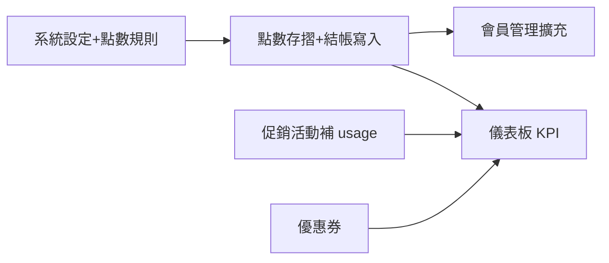

# Loyalty CRM 範本對齊 — 開發計畫與前後端分派

> 依設計範本六區：**儀表板、點數存摺、促銷活動、會員管理、優惠券、系統設定**。  
> **現況對照**：後台已有 **促銷規則**（`/admin/promotions`）、**客戶匯入**、**Dashboard 摘要**（非 Loyalty 專用）；**尚無** 點數流水、優惠券實體、Loyalty 專用導航與 KPI。

---

## 一、範本畫面 ↔ 功能 ↔ 現況

| 範本畫面 | 主要功能 | 現況 | 缺口 |
|----------|----------|------|------|
| **儀表板** | 四張 KPI（總活動點數、本月發放、即將到期、進行中活動數）；最近點數異動表；進行中促銷列表 | 無點數 KPI；Dashboard 為金流／訂單向 | 點數 aggregate API、Ledger 最近 N 筆、促銷「進行中」列表可複用 PromotionRule |
| **點數存摺** | Append-only 流水；搜尋；Tab：全部／Earned／Burned／Locked／Expired；欄位含總點數、訂單連結 | 無 | **PointLedger** 表 + 列表/搜尋 API；結帳寫入 EARN/BURN；LOCKED 可對應 POS 未結帳鎖點（選配） |
| **促銷活動** | 活動表：ID、名稱、類型、狀態、優先權、互斥、期間、**使用次數** | **PromotionRule** + AdminPromotionsPage 已有 CRUD | 補 **usageCount**（訂單完成時 increment）；狀態 **進行中／申請中／已結束** 由 draft+日期推導或加欄位；UI 對齊範本表格式 |
| **會員管理** | 搜尋 ID/姓名/電話；新增會員；表：等級標籤、**配發點數**、**即將到期點數**、到期日、加入日 | Customer 基本欄位 + import | 擴欄位 + **點數餘額／即將到期** API（依 Ledger 聚合） |
| **優惠券** | 搜尋券號/會員；狀態：未使用、Locked、已核銷、已過期 | 無 | **CouponTemplate + CustomerCoupon** 全模組 |
| **系統設定** | 集點規則、折抵比、生日加碼、效期模式、到期通知、POS/ERP 連線狀態 | 無 | **LoyaltySettings**（每 merchant 一列 JSON 或欄位）；ERP 可先做占位 |

---

## 二、建議實作階段（對齊範本優先順序）

| 階段 | 交付範本 | 後端 | 前端 |
|------|----------|------|------|
| **L0** | 壳 + 路由 | — | **Loyalty CRM 側欄**（六連結）、layout、深藍側欄視覺對齊範本 |
| **L1** | 系統設定 | `LoyaltySettings`、GET/PATCH `GET /loyalty/settings?merchantId=` | **系統設定頁** 三卡片（集點規則、效期、整合狀態占位） |
| **L2** | 點數存摺 | `PointLedger`（type, delta, balanceAfter, customerId, description, posOrderId, txnCode）；`GET /loyalty/point-ledger` 分頁+搜尋+type 篩選；結帳路徑 **EARN** | **點數存摺頁** 表 + Tab + 搜尋 |
| **L3** | 會員管理 | Customer 擴充 **memberCode**（顯示 M001）、**joinDate**；`GET /customers` 列表含 **balance**、**expiringSoon**、**expiringAt**（由 Ledger+效期規則算） | **會員管理頁** 對齊範本表 + 新增會員 Modal |
| **L4** | 儀表板 | `GET /loyalty/dashboard`：四 KPI + 最近流水 5 筆 + 進行中促銷（查 PromotionRule） | **儀表板頁** 四卡 + 兩區塊 |
| **L5** | 促銷活動 | PromotionRule 或關聯表 **usageCount**；排程/即時 +1 | **促銷活動頁** 遷入 Loyalty 壳或共用組件，對齊欄位 |
| **L6** | 優惠券 | Coupon 全 API + POS 核銷 | **優惠券管理頁** + POS 選券（可後置） |

---

## 三、後端分派（依模組）

| 優先 | 工作項 | API / 資料 | 備註 |
|------|--------|------------|------|
| P0 | LoyaltySettings | merchantId、earnPerNT、pointValueNT、birthdayMultiplier、expiryMode、rollingDays、notifyDaysBefore | 單表即可 |
| P0 | PointLedger | append-only；unique txnCode；type ENUM EARNED/BURNED/LOCKED/EXPIRED | LOCKED/EXPIRED 可 Phase2 |
| P0 | 結帳寫 Ledger | PosOrder create 成功後依 settings 寫 EARNED；折點寫 BURNED | 與現有 transaction 同事務 |
| P1 | GET point-ledger | query: q, type, page, merchantId | join Customer name |
| P1 | GET loyalty/dashboard | aggregates + last 5 ledger + active rules count | 快取可後做 |
| P1 | Customer 列表擴充 | list 回傳 balance、expiringSoon | SQL 或子查詢 |
| P2 | Promotion usageCount | 訂單完成 hook | migration 加欄位 |
| P2 | CouponTemplate + CustomerCoupon | CRUD + list + redeem | 見 crm-member-roadmap D |

**合約**：新增 **`docs/api-design-loyalty.md`**（settings、ledger、dashboard、coupons）；錯誤碼 **backend-error-format**。

---

## 四、前端分派（依畫面）

| 優先 | 工作項 | 路由建議 | 備註 |
|------|--------|----------|------|
| P0 | **LoyaltyLayout** | `/admin/loyalty/*` 或獨立 `/loyalty/*` | 側欄六項與範本一致 |
| P0 | 系統設定 | `/admin/loyalty/settings` | 表單綁 PATCH settings |
| P0 | 點數存摺 | `/admin/loyalty/point-ledger` | Tab + 表 + 查看全部 → 同頁分頁 |
| P1 | 儀表板 | `/admin/loyalty` | 四卡 + 兩表 |
| P1 | 會員管理 | `/admin/loyalty/members` | 可重用 customerApi + 新欄位 |
| P2 | 促銷活動 | `/admin/loyalty/promotions` | 包一層範本表頭；內部可 iframe 或重用 AdminPromotionsPage 資料 |
| P2 | 優惠券 | `/admin/loyalty/coupons` | 全新頁 |

**UI**：對齊範本 — 深藍側欄、白主區、綠/紅/橙/灰 **類型 Tag**、藍連結訂單號。

---

## 五、與既有後台關係

- **不重複造輪**：促銷規則仍用 **PromotionRule API**；Loyalty **促銷活動頁** = 同一資料 + usageCount + 範本版式。
- **客戶主檔**：仍 **Customer**；Loyalty **會員管理** = 列表欄位擴充 + 點數欄來自 API。
- **Admin 總側欄**：可加一項 **「Loyalty CRM」** 進入 `/admin/loyalty`。

---

## 六、驗收清單（範本對齊）

- [ ] 側欄六項皆可進入對應頁（占位亦可先「即將推出」）。
- [ ] 點數存摺：篩選與搜尋與後端一致；結帳一筆後出現 EARNED 列。
- [ ] 儀表板：四數字與流水、活動數與後端一致（可 seed 造數）。
- [ ] 會員表：等級標籤、點數、即將到期與設定之滾動效期一致。
- [ ] 系統設定：儲存後下一筆結帳套用新回饋比（測試用）。

---

## 七、相關文件

- 完整 CRM 階段（含分群、合併）：[crm-member-roadmap.md](crm-member-roadmap.md)
- 索引：[README.md](README.md)
