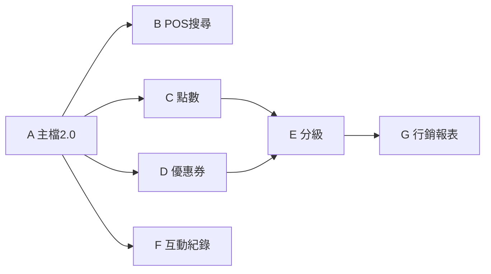

# 會員／CRM 完整開發計畫（對齊 erp-spec §4、§7）

> **現況**：`Customer` 僅 **code / name / phone / email / memberLevel**；已有 **GET 列表**、**preview/apply 匯入**、POS **掛單 customerId**、**PromotionRule.memberLevels**。  
> **目標**：分階段補齊 **§4 CRM 基礎** → **§4.2 資產** → **§7 進階**，每階段可獨立驗收。

---

## 階段總覽

| 階段 | 主題 | 後端核心 | 前端核心 |
|------|------|----------|----------|
| **A** | 會員主檔 2.0 | 欄位擴充、CRUD、合併／標籤／黑名單（最小） | 會員列表／詳情／編輯、搜尋（手機／姓名／卡號） |
| **B** | POS 找會員 | 查詢 API、可選卡號 | POS 掃碼／搜尋選客、匿名結帳 |
| **C** | 點數 1.0 | 餘額、交易明細、結帳累點／折點 | 結帳顯示點數、後台手調 |
| **D** | 優惠券 1.0 | 券種、發放、核銷、與 POS 併單 | 後台發券／列表；POS 選券 |
| **E** | 分級／分群 | 規則表、批次升降級、分群查詢 | 後台規則設定、名單匯出 |
| **F** | 互動紀錄 | ContactLog、備註、追蹤事項 | 後台時間軸、匯出名單 |
| **G** | 行銷與促銷整合 | 生日券／回購券 job、報表 API | 活動報表、與既有 Promotion 並行 |

---

## 階段 A — 會員主檔 2.0（§4.1）

### 後端

| 項目 | 說明 |
|------|------|
| **Schema** | `Customer` 擴充：`gender`、`birthDate`、`address`、`memberCardNo`、`registerSource`、`registerAt`、`status`（ACTIVE/BLOCKED）、`smsOptIn`、`emailOptIn`、`consentAt`、`consentVersion`；**標籤**多對多 `CustomerTag` / `Tag`；**黑名單**可用 `status` + `blockReason`。 |
| **API** | `GET/PATCH /customers/:id` 詳情；`POST /customers` 單筆建檔；`GET /customers` 篩選（phone、name、level、tag、status）；**合併** `POST /customers/merge`（主檔 id + 併入 ids，交易歸戶）。 |
| **合約** | `docs/api-design.md` 新章 **§6.7 會員主檔**；錯誤碼 **backend-error-format**。 |
| **Migration** | 可空欄位預設，舊列相容。 |

### 前端

| 項目 | 說明 |
|------|------|
| **後台** | 新頁 **`/admin/customers`**（列表+篩選）或擴充既有 import 頁旁「會員列表」；**詳情 Drawer**：編輯基本欄位、標籤多選、停用／黑名單。 |
| **合併 UI** | 選兩筆 → 合併精靈（選留存主檔）。 |

### 驗收

- Seed 補 2～3 筆帶標籤／等級；列表篩選正確；合併後 POS 舊單仍可查歷史 customerId（或 document 約定改指向主檔）。

---

## 階段 B — POS 找會員（§5.1 步驟 2）

### 後端

| 項目 | 說明 |
|------|------|
| **API** | `GET /customers/search?q=&merchantId=`（phone/name/card 模糊）；回傳 `id, name, phone, memberLevel, memberCardNo`；**Admin Key 可選**（僅 POS 登入場景可用較鬆或改 session）。 |

### 前端

| 項目 | 說明 |
|------|------|
| **POS** | 結帳前 **搜尋會員**（輸入電話末四／姓名）；選取帶入 `customerId`；**匿名**清除關聯。 |
| **選配** | 掃碼框（卡號 = `memberCardNo` 查詢）。 |

---

## 階段 C — 點數 1.0（§4.2 點數）

### 後端

| 項目 | 說明 |
|------|------|
| **Schema** | `PointRule`（merchant、累積比、等級倍數、有效期型別）；`CustomerPointBalance`；`PointLedger`（EARN/REDEEM/ADJUST、ref、note）。 |
| **API** | `GET /customers/:id/points`；`POST /customers/:id/points/adjust`（Admin）；結帳 **createOrder** 內：依規則 **EARN**、可選 **REDEEM**（折抵上限）。 |
| **一致性** | 與 **FinanceEvent**／**PosOrder** 同一交易；失敗 rollback。 |

### 前端

| 項目 | 說明 |
|------|------|
| **POS** | 結帳顯示 **目前點數、本筆預計贈點、可折抵點數**（輸入折抵量）。 |
| **後台** | 點數規則頁；會員詳情 **點數流水**。 |

---

## 階段 D — 優惠券 1.0（§4.2 券）

### 後端

| 項目 | 說明 |
|------|------|
| **Schema** | `CouponTemplate`（類型、門檻、期間、限次）；`CustomerCoupon`（發放、已用次數）；核銷綁 **PosOrder**。 |
| **API** | 發放 `POST /coupons/issue`；會員可用列表 `GET /customers/:id/coupons/available`；結帳 **apply coupon**。 |
| **與 Promotion** | 促銷引擎算完後再算券；或規格定 **互斥優先序**。 |

### 前端

| 項目 | 說明 |
|------|------|
| **後台** | 券模板 CRUD、批次發放（CSV 或勾選分群）。 |
| **POS** | 結帳 **選券** 下拉／掃碼。 |

---

## 階段 E — 分級／分群（§7.1）

### 後端

| 項目 | 說明 |
|------|------|
| **分級** | `TierRule`（累積金額／筆數／活躍月數）；**job** 或 **API** `POST /crm/recalc-tiers`；手調 `PATCH /customers/:id` memberLevel + audit。 |
| **分群** | `Segment`（JSON 條件）；`GET /crm/segments/:id/preview` 回傳 customer ids 或 count；匯出 CSV。 |

### 前端

| 項目 | 說明 |
|------|------|
| **後台** | 分級規則表、手動調等級、分群建立／預覽／匯出。 |

---

## 階段 F — 互動紀錄（§7.3）

### 後端

| 項目 | 說明 |
|------|------|
| **Schema** | `CustomerContactLog`（type、note、nextFollowUpAt、createdBy）。 |
| **API** | `GET/POST /customers/:id/contacts`。 |

### 前端

| 項目 | 說明 |
|------|------|
| **後台** | 會員詳情 **時間軸**；新增一筆聯絡紀錄。 |

---

## 階段 G — 行銷整合與報表（§7.2 剩餘）

實作規格與**已採用決策**見 **[api-design.md §6.8.1、§6.8.2](api-design.md)**。

### 後端（已採用）

| 項目 | 說明 |
|------|------|
| **Job 狀態** | **B** — 新增 **GET /crm/jobs/:id**，crm 專用 job 表（如 `CrmMarketingJob`）；response 含 status、result（sent/skipped/errors）、error。 |
| **生日券／回購券** | **B2 + R3** — 皆改為**依分群發券**。Request body：merchantId、**segmentId**、couponId｜couponCode。不新增 Customer 生日欄位；「生日」可由營運建分群或名單。 |
| **發券規則常駐（選配）** | 可新增「行銷發券規則」實體（啟用／停用、排程如每日／每週／每月），類似促銷活動設定；cron 掃啟用規則並執行發券。並記錄最近執行結果欄位：`lastRunAt/lastRunCode/lastRunNote`（例如 SENT/FAILED/SKIPPED + 摘要），供前端顯示。\n\n最小正式化保護（若要上線）：\n- **重複發券防護（同期間）**：同一規則在同一 period（daily/weekly/monthly）已跑過則標記 `SKIPPED`，避免重複觸發。\n- **失敗重試策略**：規則觸發失敗時，將 `nextRunAt` 往後延（例如 +30min）以便自動重試，並寫入 `FAILED` + lastRunNote。 |
| **報表** | 活動參與筆數、用券數、點數成本；候選 GET /loyalty/reports/activity，見 api-design §6.8.2。 |

### 前端

| 項目 | 說明 |
|------|------|
| **後台** | 報表頁篩選活動／期間；與既有 **促銷規則** 列表並陳。觸發「等級重算／分群發券」按鈕呼叫 POST /crm/recalc-tiers、POST /crm/jobs/:kind（body 含 segmentId + couponId）；輪詢 **GET /crm/jobs/:id** 查狀態。選配：發券規則列表、新增／編輯規則（分群、券、啟用、排程）。 |

### full profile 驗證（E2E / CI）
在 `E2E_PROFILE=full` 時可用 `e2e/admin-dispatch-rules.spec.ts` 做「發券規則常駐」的端到端驗收：

1. 後台開啟 `/admin/dispatch-rules`，確認 `E2E-RULE-ENABLED-0001` 在觸發後會顯示 `lastRunAt/lastRunCode/lastRunNote`（`lastRunCode` 為 `SENT/SKIPPED/FAILED` 之一）。
2. 觸發 runner：人工可到 `/admin/ops/jobs?kind=crm-run-scheduled` 點「補跑」，E2E 會直接呼叫 POST `/ops/jobs/run`（`kind=crm-run-scheduled`）。
3. 驗證對應關係：回到 `/admin/ops/jobs?kind=crm-run-scheduled`，確認 table 有 `crm-run-scheduled`，且訊息包含 `jobId=`（表示本輪規則已被導向執行）。

---

## 前後端分工原則（給 Agent 用）

| 層級 | 後端負責 | 前端負責 |
|------|----------|----------|
| **資料真實來源** | Schema、migration、唯一性、合併歸戶、點數／券與訂單原子性 | 不重算業務規則；只送合法 payload |
| **API 契約** | 先寫 **api-design**、錯誤碼、分頁 | 對齊 DTO、錯誤 toast |
| **權限** | Admin Key／日後 RBAC | 無 Key 時 disabled + 說明 |
| **批次／報表** | 匯出 CSV、job 狀態 | 觸發按鈕、輪詢、下載 |
| **POS 體感** | 搜尋要快（索引 phone、card） | 搜尋 UX、少步驟結帳 |

---

## 建議實作順序（依賴）

**P0 上線最小集**：**A + B**（主檔擴充 + POS 找得到人）。  
**P1 營收感**：**C 或 D 擇一**。  
**P2 營運**：**E + F**。  
**P3**：**G**。

---

## 與現有 INSTRUCTIONS 的銜接

- 規格 Agent 可在某一輪把 **BACKEND §1** 設為「階段 A migration + CRUD + api-design §6.7」；**FRONTEND §1** 設為「admin customers 列表+詳情」。  
- 完成後 **agent-log** 標註 **CRM-A done**，下一輪再 **CRM-B**，避免單輪過大。
