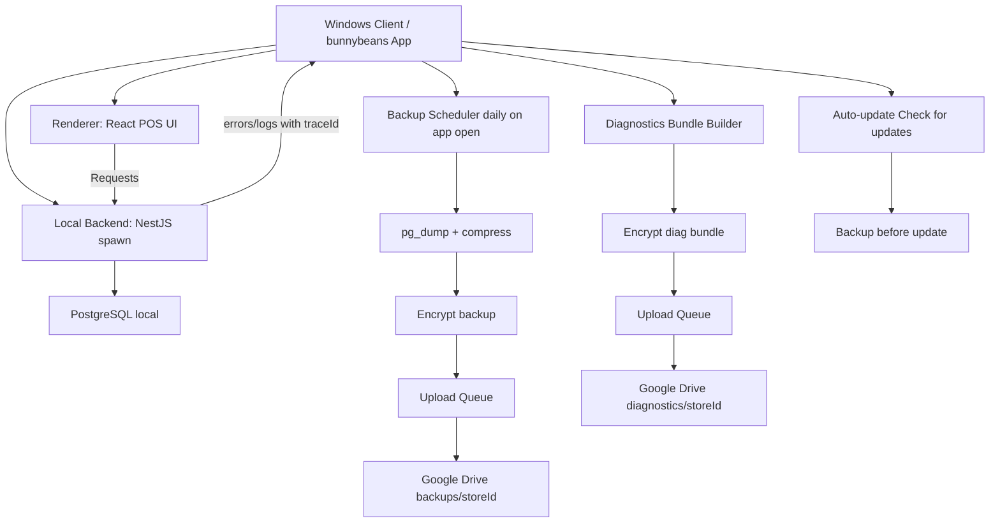

# bunnybeans 可交付版指令總表（Windows / Electron）

> **使用方式**：本文件為單一入口，可直接整份丟給 Agent 作為執行指令。開始開發時，依序完成各 Milestone 與對應 Todo。

---

## 1. 前提與已選擇

- **客戶端**：Windows PC（每日關機、門市人員只需操作 App）
- **桌面**：Electron（React/TS 复用既有前端 UI）
- **資料庫**：PostgreSQL，**交付包需 bundle 並自動安裝/管理**
- **雲端**：你方「專用 Google Drive」，備份/診斷上傳使用 **Google Drive API + OAuth**（程式直接上傳）
- **加密**：全客戶共用一把金鑰（支援輪替）；備份/診斷皆為 client-side encryption

---

## 2. Google 備份帳號設定（已完成）

> 已備好 Google 備份用帳號。下列為**設定規格與操作步驟**，**請勿寫入密碼或敏感憑證**。

### 2.1 Google Cloud 專案與 API

- **用途**：讓 bunnybeans App 透過 OAuth 上傳備份/診斷檔至專用 Drive
- **必要啟用 API**：Google Drive API
- **OAuth 設定**：
  - 應用程式類型：桌面應用程式（Desktop app）
  - 授權範圍（Scopes）：
    - `https://www.googleapis.com/auth/drive.file`（僅存取 App 建立的檔案）
    - 或 `https://www.googleapis.com/auth/drive.appdata`（若僅放應用程式資料）
  - 重定向 URI：依 OAuth 2.0 桌面流程（device flow 或 loopback）設定

### 2.2 Drive 目錄結構（你方專用帳號登入後）

- 根資料夾：`/bunnybeans/`
- 分流：
  - `/bunnybeans/backups/<storeId>/YYYY/MM/`（備份檔）
  - `/bunnybeans/diagnostics/<storeId>/YYYY/MM/`（診斷包）

### 2.3 操作步驟（首次佈署時）

1. 在 Google Cloud Console 建立 OAuth 2.0 用戶端 ID（桌面應用程式）
2. 將 `client_id`、`client_secret`（或僅 client_id，依流程）存於**環境變數或受保護的設定檔**，**勿 commit 進 repo**
3. App 內首次執行時：觸發 OAuth 登入流程，使用者以專用帳號授權
4. 存取權杖（access token / refresh token）存於本機安全存放區（例如 `C:\ProgramData\bunnybeans\meta\` 加密檔）

---

## 3. 目標交付物（MVP→可維運）

1. **bunnybeans Windows 桌面 App**：開啟即能連本機後端、可掃碼（鍵盤式）與 A4 列印
2. **日誌/診斷**：錯誤可匯出診斷包，並自動上傳或留待佇列隔天補送
3. **DB 備份**：每日 1 次（App 開機/開啟觸發），`pg_dump`→壓縮→加密→上傳 Drive；本機保留 30 天、Drive 保留 90 天
4. **更新**：門市點「檢查更新」即可；更新前做一次 DB 備份；更新後健康檢查失敗可回滾
5. **手冊**：門市操作 + 客服/工程支援（含 Drive/還原/回滾）可直接產生 PDF

---

## 4. Data flow（建議驗收用）

---

## 5. 里程碑與 Todo 清單

### Milestone 0：交付骨架與手冊產生器串接

- [ ] **ms0-manual-pdf-extend**：讓 `docs/manual/appendix/store-ops.md` 與 `docs/manual/appendix/support-runbook.md` 真正出現在 PDF；更新 `scripts/manual/build-manual.ts` 的 `chapters[]` 並加入兩章（附錄：門市端維運、附錄：客服/工程支援）
- [ ] **ms0-desktop-workspace**：新增 `desktop/` workspace；補到 `pnpm-workspace.yaml`，並建立 `desktop/package.json` 與 root scripts（build/pack/dev）
- [ ] **ms0-electron-shell**：在 `desktop/` 建立 Electron shell（main process、renderer entry）；renderer 复用既有 `frontend` build 產物（或在 dev 模式用本機 dev server）

### Milestone 1：Electron App（MVP 可用）

- [ ] **ms1-local-backend-spawn**：Electron 啟動時自動啟動本機 backend（spawn 本機 NestJS）；並把 backend log/exit 事件導入本機診斷 log 檔
- [ ] **ms1-pos-scanner-focus-print**：UI 層驗收與必要修正：掃碼槍鍵盤輸入的焦點策略、Enter 行為；A4 列印使用固定模板/列印流程（至少做到列印成功與格式一致）

### Milestone 2：PostgreSQL bundle（自動安裝/初始化）

- [ ] **ms2-postgres-bundle**：PostgreSQL bundle；交付包內置/引用安裝方式（silent install），資料目錄落到 `C:\ProgramData\bunnybeans\data\`；初始化 DB/使用者並讓 backend 使用生成的 `DATABASE_URL`

### Milestone 3：加密日備份（pg_dump→加密→Drive API 上傳）

- [ ] **ms3-backup-enc-drive**：加密日備份：實作 `pg_dump`→壓縮→client-side encryption→落地 pending→Drive API OAuth→上傳到 `/bunnybeans/backups/<storeId>/YYYY/MM/`；加上佇列重試與保留策略（本機 30 天、Drive 90 天）
- [ ] **ms3-backup-automation-trigger**：備份觸發策略：每日 1 次（App 第一次開啟/或開啟後補送昨日漏件）；並維持 `pending`/`sent` 狀態寫入 `meta`（`storeId`、上次成功備份時間）

### Milestone 4：錯誤/診斷包收集（可匯出 + 自動上傳）

- [ ] **ms4-diagnostics-bundle**：診斷包機制：在 renderer 收集 unhandled errors/console、在 main 收集 backend stdout/stderr（含 traceId request log）；組裝 `diag_*.zip.enc` 並提供 UI 的「匯出診斷包」
- [ ] **ms4-diagnostics-upload**：診斷包上傳：Drive API 上傳到 `/bunnybeans/diagnostics/<storeId>/YYYY/MM/`；失敗留 pending 並在下次開啟補送
- [ ] **ms4-redaction**：去敏規範落地：診斷包/錯誤摘要的 PII 遮罩規則（電話/Email 等），確保 log 可用但不外洩

### Milestone 5：更新機制（檢查更新 + 前置備份 + 回滾）

- [ ] **ms5-auto-update**：Electron auto-update：支援門市「檢查更新」；更新前必做一次可用的加密 DB 備份並進 pending；更新後做最小健康檢查（backend 可連 DB + POS 基本流程）。失敗回滾

### Milestone 6：驗收與測試（門市可跑的必做）

- [ ] **ms6-acceptance-checklist**：把門市驗收 checklist 寫進手冊：掃碼/A4 列印/備份/診斷包/更新；並補 `docs/manual/assets/` 的占位圖片檔名
- [ ] **ms6-smoke-validation**：交付級驗證：建立至少一套端到端驗收流程（可用手動 step 或半自動腳本）；確保 backup/diagnostics/更新/回滾可在「每日關機」前提下運作

### Milestone 7：手冊完善（已準備的與要補的）

- [ ] **ms7-remaining-manual-chapters**：補齊缺失的手冊章節：Electron 安裝/更新、Google Drive OAuth 登入與權限、金鑰輪替策略、診斷包內容清單（與去敏）、以及客戶回報流程

---

## 6. 執行順序建議

1. 先完成 **Milestone 0、1**（骨架 + Electron 能跑）
2. 再做 **Milestone 2**（PostgreSQL 打包）
3. 接著 **Milestone 3、4**（備份 + 診斷 + Drive 上傳）
4. 最後 **Milestone 5、6、7**（更新 + 驗收 + 手冊完善）
5. 產出 PDF：`pnpm manual:build`

---

## 7. 相關文件索引

| 用途 | 路徑 |
|------|------|
| 門市端維運（備份/更新/診斷） | `docs/manual/appendix/store-ops.md` |
| 客服/工程支援 runbook | `docs/manual/appendix/support-runbook.md` |
| 錯誤格式 + traceId | `docs/backend-error-format.md` |
| DB seed | `docs/db-seed.md` |
| 部署（Vercel/Preview） | `docs/deploy-preview.md` |
| E2E 測試 | `docs/e2e-pos.md` |
