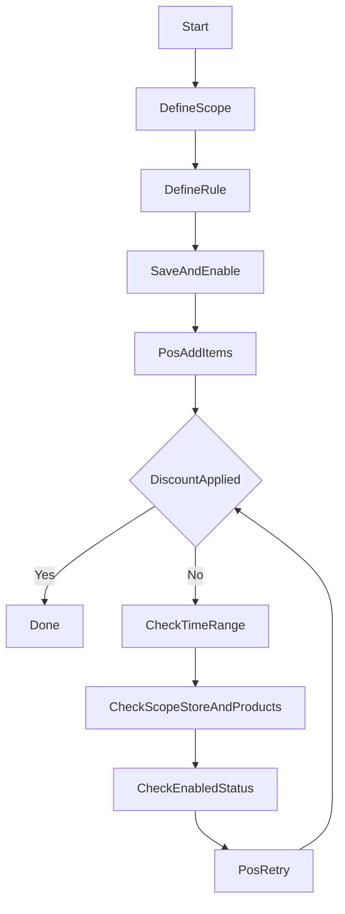

## 促銷（規則、POS 驗證）

---

## 建立促銷並在 POS 驗證

## 目的

- 建立一個促銷規則（折扣/滿額/第二件等），並確認 POS 能正確套用。

## 前置條件

- 你已有要參與促銷的商品（或分類/標籤）。
- 你知道促銷生效時間與適用門市（若有）。

## 操作步驟（3–7 步）

1. 進入「促銷 / 促銷活動」。
2. 按「新增促銷」。
3. 填寫名稱、生效時間（開始/結束）、適用範圍（門市/商品/分類/標籤）。
4. 選擇促銷類型並設定規則（折扣%、折抵金額、門檻等）。
5. 儲存並啟用。
6. 到 POS 新增符合條件的商品到購物車。
7. 檢查是否顯示折扣與正確金額。

## 流程圖（UI 未完成時先看這個）

## 成功判斷

- 後台促銷狀態為啟用；POS 結帳金額與折扣明細符合預期。

## 常見錯誤與排除

- **POS 沒有套用**：確認促銷已啟用、時間在有效期、範圍包含該商品/門市。
- **折扣算錯**：先用 1–2 個商品最小案例測試，逐步縮小規則範圍（商品 → 分類 → 標籤）。

## 圖示

- （待補）`docs/manual/assets/05_promo_create_01.png`
- （待補）`docs/manual/assets/05_pos_verify_01.png`

