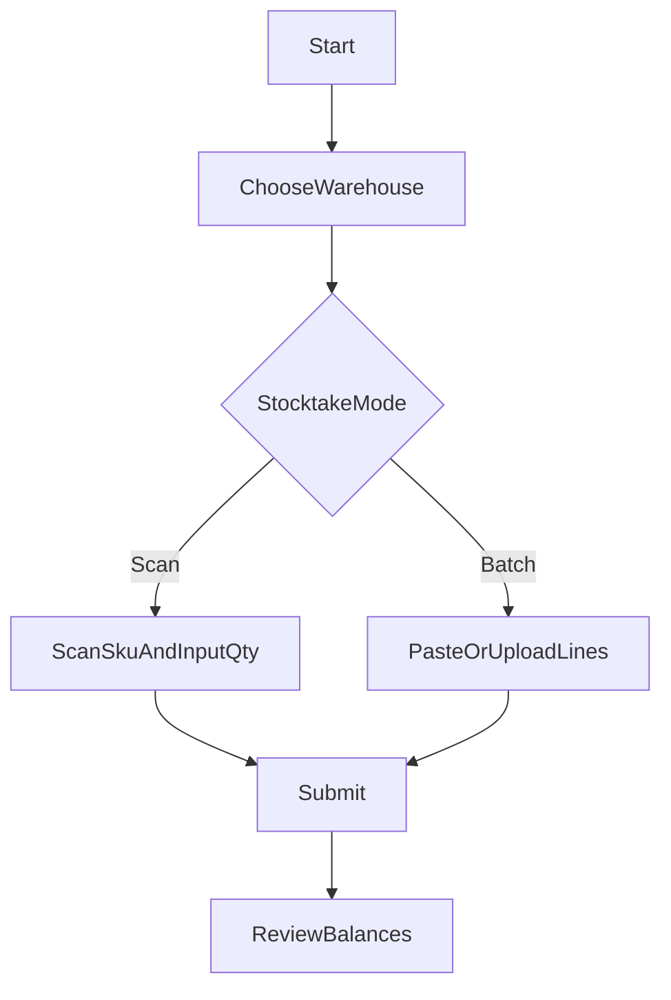
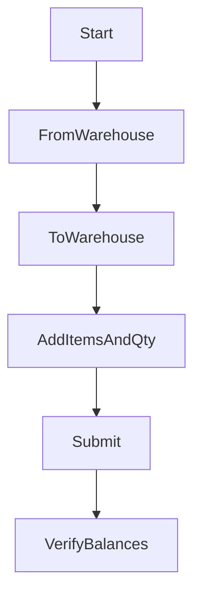

## 庫存（查詢/調整/批號效期/補貨建議）

---

## 查詢庫存

## 目的

- 以商品或倉庫維度快速查看現有庫存。

## 前置條件

- 你已建立至少一個倉庫/門市。

## 操作步驟（3–7 步）

1. 進入「庫存 / 庫存查詢」。
2. 用商品名稱/SKU/條碼搜尋商品。
3. 檢查總庫存與各倉庫庫存（若有）。

## 成功判斷

- 查得到正確商品，庫存數量合理。

## 常見錯誤與排除

- **庫存為 0 但應該有量**：確認是否尚未做初始入庫/驗收，或是否看錯倉庫。

## 圖示

- （待補）`docs/manual/assets/06_inventory_search_01.png`

---

## 庫存調整（盤點/報廢/補差）

## 目的

- 直接調整某倉庫的庫存數量並留下原因。

## 前置條件

- 你知道要調整的倉庫與商品。

## 操作步驟（3–7 步）

1. 進入「庫存 / 庫存調整」。
2. 選擇倉庫。
3. 選擇商品，輸入調整數量（增加/減少）或調整後結存（依 UI）。
4. 填寫原因（盤點、報廢、補差等）。
5. 送出。

## 成功判斷

- 庫存查詢頁顯示數量已更新，且調整紀錄可追蹤（若有事件/紀錄頁）。

## 常見錯誤與排除

- **不允許調到負數**：改用正確的調整方式或先確認是否有未入帳出庫。

## 圖示

- （待補）`docs/manual/assets/06_inventory_adjust_01.png`

---

## 盤點（掃碼盤點 / 批次盤點）

## 目的

- 用盤點結果把系統庫存校正為「實際數量」，並留下可追溯紀錄。

## 前置條件

- 你已選定要盤點的倉庫。
- 你有盤點清單（或現場掃碼逐項盤）。

## 操作步驟（3–7 步）

1. 進入「庫存 / 盤點」。
2. 選擇倉庫。
3. 二選一：
   - **掃碼盤點**：用 SKU（後續可能支援條碼）逐項輸入實際數量。
   - **批次盤點**：貼上/上傳盤點列（商品 + 實際數量）。
4. 送出盤點。
5. 抽查幾個品項：庫存查詢顯示已被校正。

## 流程圖（決策）

## 成功判斷

- 盤點完成後，該倉庫的庫存與盤點數一致。

## 常見錯誤與排除

- **SKU 查不到商品**：先回商品主檔確認 SKU 是否正確、是否有多 SKU/重複問題。

## 圖示

- （待補）`docs/manual/assets/06_stocktake_01.png`

---

## 庫存調撥（倉庫 A → 倉庫 B）

## 目的

- 把庫存從一個倉庫移到另一個倉庫（例如總倉補門市倉）。

## 前置條件

- 來源倉庫有足夠庫存。

## 操作步驟（3–7 步）

1. 進入「庫存 / 調撥」。
2. 選擇來源倉庫與目的倉庫。
3. 加入調撥商品與數量。
4. 送出調撥。

## 流程圖（最短 SOP）

## 成功判斷

- 來源倉庫庫存減少、目的倉庫庫存增加。

## 常見錯誤與排除

- **庫存不足（409）**：降低調撥數量，或先確認來源倉庫是否有未入帳的出入庫。

## 圖示

- （待補）`docs/manual/assets/06_transfer_01.png`

---

## 補貨建議

## 目的

- 依據近期銷量與目前庫存，計算各商品「建議補貨數量」，供你產生採購單草稿或人工調整下單量。

## 參數定義與運算邏輯

系統會依下列參數算出建議補貨量，你可在補貨建議頁調整後按「重新計算」更新結果。

| 參數 | 說明 | 預設值 | 允許範圍 |
|------|------|--------|----------|
| **觀察天數** | 用來推算平均日銷量的回溯天數：過去 N 天的 SALE_OUT 銷量會被納入 | 30 | 7～90 |
| **預估天數** | 要準備庫存的未來天數，代表規劃要滿足多久的銷售需求 | 30 | 1～365 |
| **安全天數** | 安全庫存緩衝天數，用於應付銷量波動或供貨延遲 | 7 | 0～90 |
| **最小建議量** | 篩選門檻：建議補貨量低於此值者不顯示（可視為不建議補貨） | 0 | 0～100,000 |

**計算公式**：

- 期間內總銷量：`totalSold`（觀察天數內的 SALE_OUT 合計）
- 平均日銷量：`avgDailySales = totalSold ÷ 觀察天數`
- 目標庫存：`targetStock = avgDailySales × (預估天數 + 安全天數)`
- 建議補貨量：`suggestedQty = max(0, 目標庫存 − 目前庫存)`（向上取整）

若某商品在觀察天數內幾乎無銷量，或建議補貨量小於「最小建議量」，則不會出現在建議清單中。

## 前置條件

- 已建立至少一個倉庫。
- 已有 POS 銷貨紀錄（SALE_OUT），系統才能推估銷量。

## 操作步驟（3–7 步）

1. 進入「採購 / 補貨建議」（或庫存相關選單）。
2. 選擇倉庫（可選全部或單一倉庫）。
3. （選用）調整「觀察天數」、「預估天數」、「安全天數」、「最小建議量」，按「重新計算」。
4. 勾選要補貨的品項，可選供應商後按「建立採購草稿」，產生採購單草稿。

## 成功判斷

- 列表顯示建議補貨量，且勾選後可順利產生採購單草稿（若有該功能）。

## 常見錯誤與排除

- **沒有建議清單或都是空的**：確認該倉庫／商品在觀察天數內有 SALE_OUT 銷量；或將「最小建議量」調低（例如 0）。
- **建議量明顯不合理**：調整觀察天數或安全天數；銷量波動大時可適度提高安全天數。

## 圖示

- （待補）`docs/manual/assets/06_replenishment_01.png`

