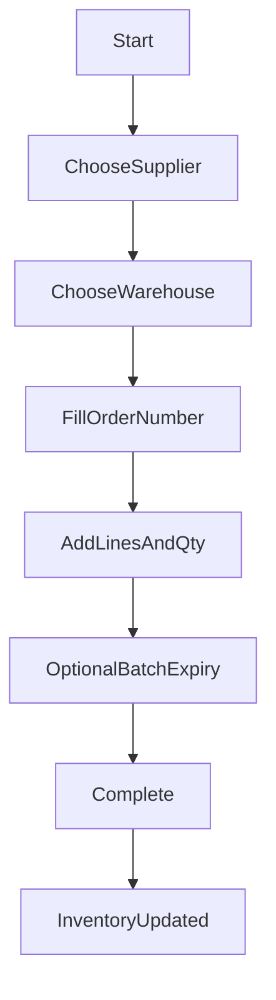

## 採購與驗收

---

## 建立採購單

## 目的

- 建立一張採購單給供應商，用於後續到貨驗收與入庫。

## 前置條件

- 你已建立供應商與要採購的商品。

## 操作步驟（3–7 步）

1. 進入「採購 / 採購單」。
2. 按「新增採購單」。
3. 選擇供應商、預計到貨日（若有）。
4. 新增採購品項與數量、成本（若有）。
5. 儲存（或送出/核准，依你們流程）。

## 成功判斷

- 採購單出現在列表，狀態正確（草稿/已送出/已核准等）。

## 常見錯誤與排除

- **找不到供應商**：先到「供應商」建立資料再回來。

## 圖示

- （待補）`docs/manual/assets/07_po_create_01.png`

---

## 到貨驗收（收貨/入庫）

## 目的

- 把採購到貨轉成驗收/收貨單，並把庫存入帳。

## 前置條件

- 已存在採購單，且供應商已送貨。

## 操作步驟（3–7 步）

1. 進入「採購 / 驗收（收貨單）」。
2. 選擇要驗收的採購單。
3. 填寫實到數量（可與採購量不同）。
4. （選用）填寫批號/效期（若有）。
5. 確認並完成驗收。

## 成功判斷

- 驗收單狀態為完成；庫存查詢可看到入庫增加。

## 常見錯誤與排除

- **庫存沒有增加**：確認是否只有建立草稿、尚未完成驗收/入庫動作。

## 圖示

- （待補）`docs/manual/assets/07_receiving_01.png`

---

## 快速進貨（一鍵完成：採購單 + 驗收 + 入庫）

## 目的

- 用最短流程完成進貨：選供應商 → 選品項 → 輸入數量 → 完成後庫存直接入帳（並建立對應單據）。

## 前置條件

- 供應商已建立。
- 你知道要入庫的倉庫與品項。

## 操作步驟（3–7 步）

1. 進入「採購 / 快速進貨」。
2. 選擇供應商與入庫倉庫。
3. 輸入採購單號（若你們需要對外單號）。
4. 加入品項並輸入數量（可選填成本、批號/效期）。
5. 按「完成」。

## 流程圖（最短 SOP）

## 成功判斷

- 系統顯示完成；庫存查詢可看到入庫增加；採購單/驗收單可追溯。

## 常見錯誤與排除

- **單號重複（409）**：換一個採購單號再送出。
- **驗收數量不合法**：確認你輸入的是正數，且沒有超出系統允許的上限。

## 圖示

- （待補）`docs/manual/assets/07_quick_receive_01.png`

