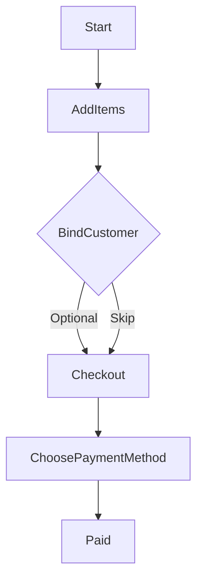
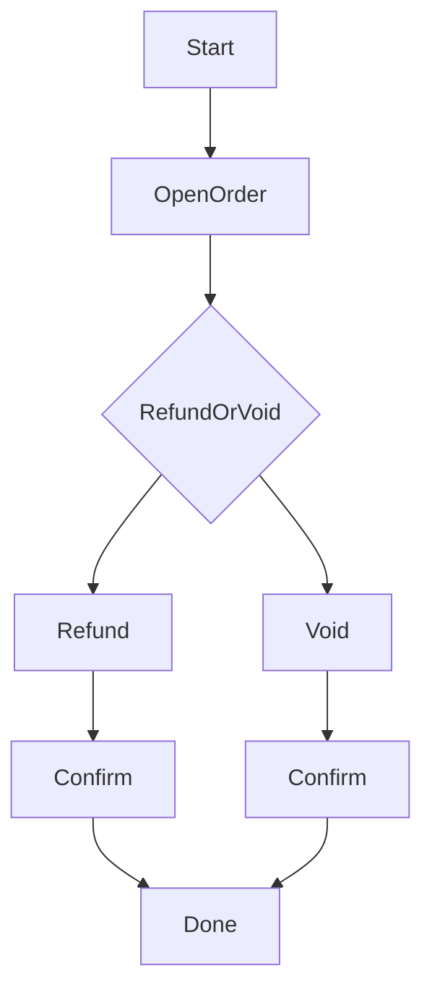

## POS 訂單（開單/付款/退款作廢）

---

## 開單並收款

## 目的

- 在 POS 建立一筆訂單並完成付款。

## 前置條件

- 你有可販售商品（已設定售價、可被搜尋/掃碼）。

## 操作步驟（3–7 步）

1. 進入 POS 畫面（Register）。
2. 搜尋或掃描條碼，把商品加入購物車。
3. （選用）綁定會員（用電話/Email 搜尋）。
4. 按「結帳」。
5. 選擇付款方式並輸入收款金額（若需要）。
6. 完成付款。

## 流程圖（最短 SOP）

## 成功判斷

- 訂單狀態為已付款；可在「Orders」查到該筆訂單。

## 常見錯誤與排除

- **結帳金額不對**：檢查是否有促銷套用、是否商品售價設定錯誤。

## 圖示

- （待補）`docs/manual/assets/08_pos_checkout_01.png`

---

## 退款/作廢

## 目的

- 對已建立訂單進行退款或作廢，並留下理由（若有）。

## 前置條件

- 已存在一筆可退款的訂單。

## 操作步驟（3–7 步）

1. 進入 POS 的「Orders」。
2. 打開要處理的訂單。
3. 選擇「退款」或「作廢」。
4. 選擇退款品項/數量（若支援部分退款）。
5. 確認並完成。

## 流程圖（決策）

## 成功判斷

- 訂單顯示已退款/已作廢；報表/交易紀錄可追溯。

## 常見錯誤與排除

- **無法退款**：可能超過可退款期限、或付款方式不支援原路退回（依你們規則）。

## 圖示

- （待補）`docs/manual/assets/08_pos_refund_01.png`

