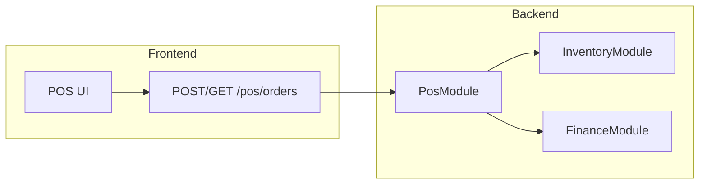

# 前後端整合進度報告與開發計畫 2026-03-13

> 整合自 `docs/progress/backend/backend-progress-2026-03-13.md` 與 `docs/progress/frontend/frontend-progress-pos-2026-03-13.md`，為前後端唯一同步來源。後續各端進度更新仍寫在各自目錄，本文件定期彙整。

---

## 一、整體開發進展

### 1.1 後端

| 項目 | 狀態 | 說明 |
|------|------|------|
| 主檔 CRUD | 完成 | Merchant / Store / Warehouse / Product 完整 REST API |
| Inventory 模組 | **stable** | `POST/GET /inventory/events`、`GET /inventory/balances`；append-only 事件，匯總由 Service 更新 |
| Finance 模組 | **stable** | `POST /finance/events`（Phase 1 僅寫入） |
| POS 模組 | **stable** | `POST /pos/orders`、`GET /pos/orders`、`GET /pos/orders/:id`；結帳時後端內部串 Inventory + Finance，前端不需呼叫該兩模組 |
| Seed | 完成 | M001 / S001 / W001、三筆商品與庫存；見 `docs/db-seed.md` |
| 錯誤格式與 Logging | 完成 | 統一 JSON 錯誤（statusCode / message / error / traceId）；request log 含 traceId、durationMs；見 `docs/backend-error-format.md` |
| 整合測試 | 完成 | POS 建立訂單 → 庫存扣減 → 金流事件 已通過 |
| API 文件 | 完成 | `docs/api-design-pos.md`、`docs/api-design-inventory-finance.md` 相關 endpoint 標 **stable**，POS 含錯誤情境、curl 與前置資料說明 |

### 1.2 前端

| 項目 | 狀態 | 說明 |
|------|------|------|
| POS 骨架與路由 | 完成 | React + Vite + TS、Tailwind v4、`/login`、`/pos`、`/pos/orders` |
| 登入與健康檢查 | 完成 | 呼叫 `GET /health` 確認後端連線 |
| POS 收銀 UI | 完成 | 商品區、購物車、小計/稅/應收、清空、結帳；`usePosCart`、5% 稅率 |
| 結帳流程（mock） | 完成 | 結帳 Modal → `createPosOrderMock` → 顯示最近一筆交易摘要；Request/Response 與 `docs/api-design-pos.md` 一致 |
| 訂單列表（mock） | 完成 | `/pos/orders` 使用 `listPosOrdersMock` 顯示分頁 |
| 共用元件 | 完成 | Button、TextInput（shared/components） |
| 篩選與商品卡 | 完成 | 三列篩選（品項/品牌/折扣）、搜尋、商品卡顯示 SKU/名稱/售價/標籤（目前分類與品牌為 mock） |

**尚未完成**：訂單明細頁 `/pos/orders/:id`；mock 尚未切換為真實 API。

### 1.3 對齊狀態

- 前後端 Request/Response 已對齊 `POST /pos/orders`、`GET /pos/orders`、`GET /pos/orders/:id`（依 `docs/api-design-pos.md`）。
- POS 前端僅呼叫 POS Orders API；庫存與金流事件由後端 PosService 寫入，前端不直接呼叫 `/inventory/*` 或 `/finance/*`。

---

## 二、串接前必讀（合約要點）

前端改接真實 API 前，以下三點務必遵守：

### 2.1 storeId / productId 為 UUID

- API 中 `storeId`、`productId` 使用主檔的 **UUID**（`id` 欄位），而非代碼（如 S001、SKU-A001）。
- 門市與商品列表可透過 `GET /stores`、`GET /products` 取得，回傳中包含 `id`。
- 若使用 seed 資料，可先透過上述 GET 取得 seed 建立的 store id 與三筆 product id。

### 2.2 付款欄位

- `payments[].amount` 為 **number**（與文件一致），不是 amountCents。
- `payments` 總和須等於 `items` 的總金額，否則後端回 400。

### 2.3 錯誤處理

- 後端統一回傳格式見 `docs/backend-error-format.md`：`statusCode`、`message`、`error`、`traceId`。
- 業務錯誤目前僅以 `message` 區分（如 `Store not found`、`Insufficient inventory for product <id>`）。
- 前端可預留 `code` → 文案 mapping 結構，待後端日後補上業務錯誤碼再對應。
- 前端可於請求帶上 `X-Trace-Id` header，方便與後端 log 對照除錯。

---

## 三、流程概覽

前端只與 POS API 通訊；庫存（SALE_OUT）與金流（SALE_RECEIVABLE）由後端 POS 模組內部呼叫 Inventory / Finance 完成。

---

## 四、下一步開發計畫（建議執行順序）

### 步驟 1：前端改接真實 POS API（必做，最高優先）

- **結帳**：`createPosOrderMock` → 呼叫 `POST /pos/orders`（base URL 用 `VITE_API_BASE_URL`）。Request 中 `storeId` / `productId` 須為 UUID，可從 `GET /stores`、`GET /products` 取得或直接使用 seed 對應 id。
- **訂單列表**：`listPosOrdersMock` → 呼叫 `GET /pos/orders`（支援 `storeId`、`from`、`to`、`page`、`pageSize`），顯示 `PosOrderSummary` 分頁。
- **驗證**：依 `docs/api-design-pos.md` 測試說明做手動或整合驗證。

### 步驟 2：錯誤處理與體驗（必做）

- 依 `docs/backend-error-format.md` 格式，在前端顯示 `statusCode` + `message` 錯誤。
- 預留 `code` → 文案 mapping 結構（待後端補錯誤碼後對應）。
- 結帳失敗時在 Modal 中顯示錯誤訊息（如庫存不足、門市不存在）。

### 步驟 3：訂單明細頁（必做）

- 新增路由與頁面 `/pos/orders/:id`，直接呼叫 `GET /pos/orders/:id`（後端已 stable，無需再經 mock）。
- 依 `PosOrderDetail` 型別顯示訂單品項、數量、單價、總額。
- 列表頁「查看明細」導向 `/pos/orders/:id`。

### 步驟 4：門市/商品資料來源（可選）

- 前端改為呼叫 `GET /stores`、`GET /products` 取得門市與商品列表，取代或補強目前 mock 資料。
- POS 三列篩選（品項/品牌/折扣）可先維持 mock 選項，待後端提供 `GET /categories`、`GET /brands` 或商品查詢參數再改接。

### 步驟 5：後端強化（可選，不阻塞前端）

- **業務錯誤碼**：在 `HttpExceptionFilter` 或各 Service 回傳中增加 `code`（如 `POS_INVALID_INPUT`、`INVENTORY_INSUFFICIENT`），並在 `docs/backend-error-format.md` 補上對照表。
- **測試**：為 Inventory / Finance 補更多整合或 e2e 測試；維持 POS 整合測試在 CI 可跑。
- **E2E**：前後端串接後可補全端 E2E（登入 → 加商品 → 結帳 → 查訂單）。

---

## 五、後端任務清單

- 維持 POS / Inventory / Finance API 穩定；若有變更需同步更新 `api-design-pos.md`、`api-design-inventory-finance.md` 與 `backend-error-format.md`。
- 可選：新增業務錯誤碼（`code` 欄位），並在 `docs/backend-error-format.md` 補上對照表。
- 可選：提供 `GET /categories`、`GET /brands` 或商品列表 API（含 category/brand/tags），供前端 POS 篩選使用。
- 為 Inventory / Finance 或關鍵流程補整合或 e2e 測試。

---

## 六、前端任務清單

- 將結帳流程與訂單列表由 mock 改為真實 API：`POST /pos/orders`、`GET /pos/orders`。
- 實作 `/pos/orders/:id` 明細頁，直接呼叫 `GET /pos/orders/:id`；列表「查看明細」導向該頁。
- 預留錯誤區塊並實作 `statusCode` + `message` 顯示（對照 `docs/backend-error-format.md`）。
- 可選：改為呼叫 `GET /stores`、`GET /products` 取得門市與商品；三列篩選視後端 API 進度決定。

---

## 七、參考文件

- 後端進度：`docs/progress/backend/backend-progress-2026-03-13.md`
- 前端進度：`docs/progress/frontend/frontend-progress-pos-2026-03-13.md`
- 前後端協作規則：`docs/collaboration-rules-backend-frontend.md`
- API 合約總覽：`docs/api-design.md`
- POS API：`docs/api-design-pos.md`
- Inventory/Finance API：`docs/api-design-inventory-finance.md`
- 庫存與金流不可變設計：`docs/inventory-finance-immutability.md`
- 錯誤格式：`docs/backend-error-format.md`
- 模組設計：`docs/backend-module-design.md`
- 專案結構與技術堆疊：`docs/project-structure.md`
- DB Seed：`docs/db-seed.md`
- 開發守則：`DEVELOPMENT-GUIDELINES.md`
- 每日進度格式：`docs/daily-progress-format.md`
- 開發前置清單：`docs/pre-development-checklist.md`（onboarding / 重啟專案時參考）
- 電商入口參考：`docs/ecommerce-entry-reference.md`（協作範圍含官網時參考）
